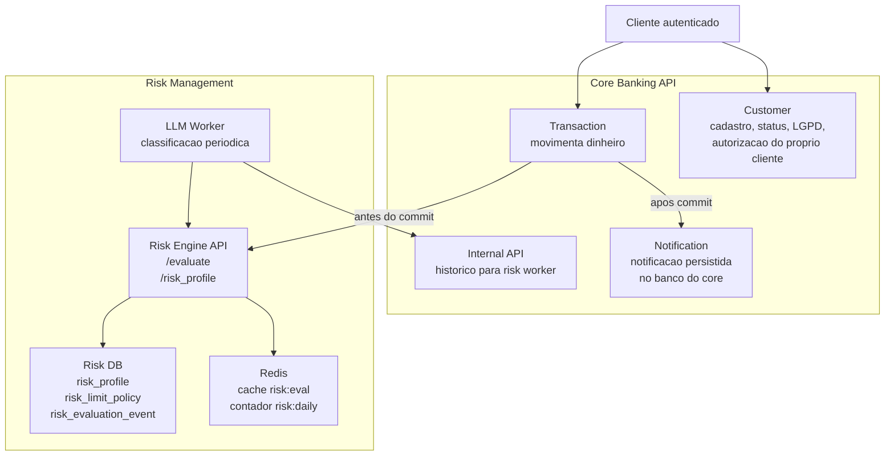
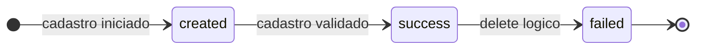
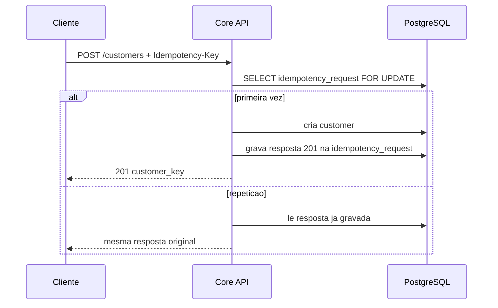
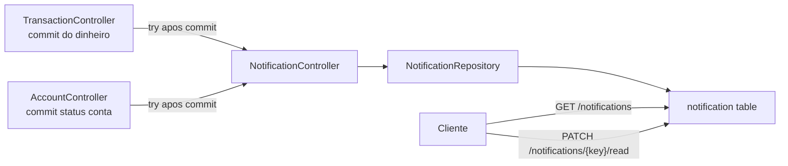
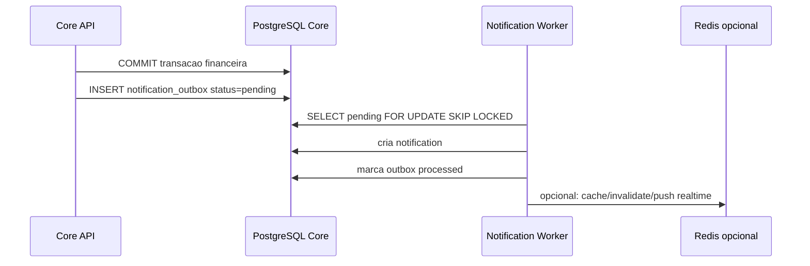
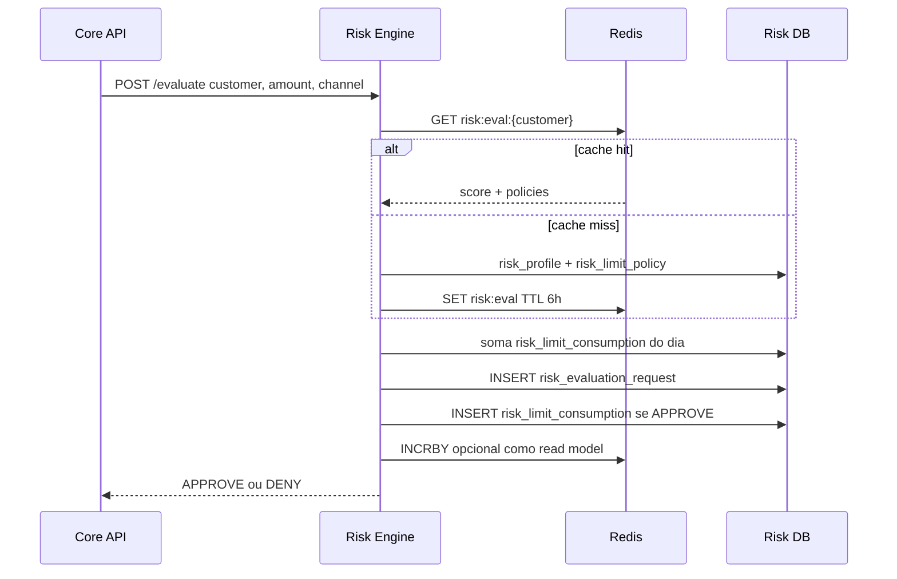
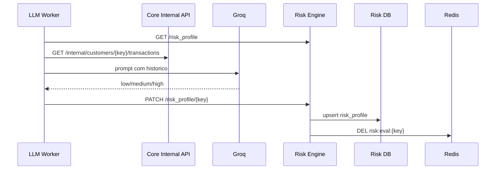
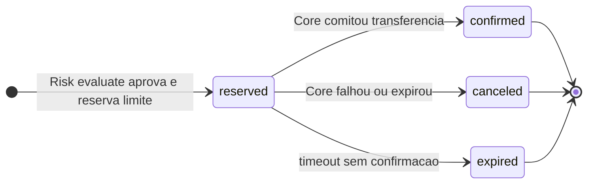
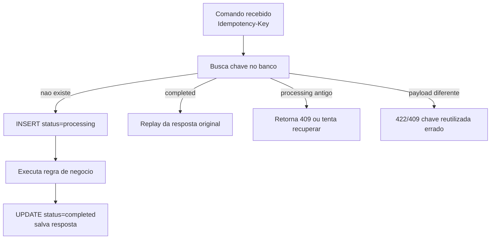
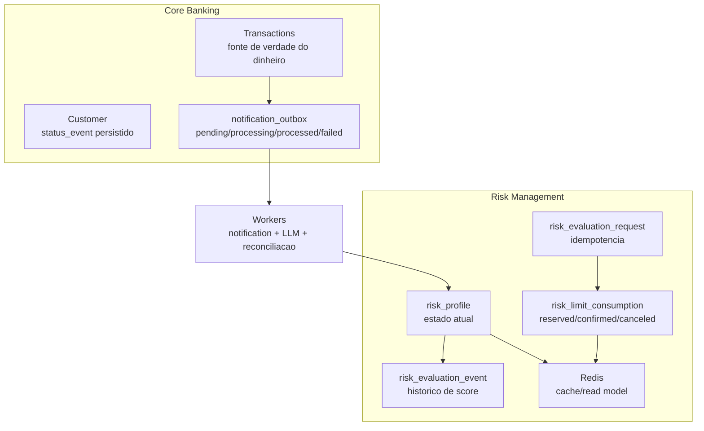

# Documentacao tecnica - Risk Management, Customer e Notification

**TIME:** Bootcamp QI Tech G33  
**DATA:** 03/10/2026  
**VERSAO:** 1.0  
**ESCOPO:** documentacao geral dos modulos trabalhados diretamente: risk management, customer e notification.

Este documento investiga tres modulos do repositorio e organiza as decisoes tecnicas no estilo QI Tech: o que existe, por que foi feito assim, qual risco foi mitigado, qual risco ainda ficou aberto e qual seria o proximo passo natural.

O ponto mais importante da conversa com o tech lead e este:

> Redis e excelente como cache e contador operacional. Redis nao deve ser a fonte de verdade de processamento financeiro ou de workflow se nao existir uma tabela persistente de estado por tras.

No codigo atual, parte do uso de Redis esta correto como cache reconstruivel. Outra parte, principalmente o acumulador diario de risco, ja encosta em comportamento de estado/processamento. Ali precisa de uma decisao explicita de idempotencia, persistencia e reconciliacao.

---

## 1. Visao geral dos tres modulos



### Leitura rapida

| Modulo | Fonte de verdade hoje | Tem tabela de estado? | Usa Redis? | Risco principal |
|---|---|---|---|---|
| Customer | PostgreSQL Core | Sim, `customer_status`, `customer_status_event` e `customer_idempotency_request` | Nao | Reconciliacao/expurgo futuro das chaves de idempotencia antigas |
| Notification | PostgreSQL Core | Parcial: tabela final `notification`, sem outbox/event state | Nao no fluxo atual | Se virar async via Redis sem outbox, perde evento em falha |
| Risk Management | PostgreSQL Risk | Sim: `risk_profile`, `risk_evaluation_event`, `risk_evaluation_request` e `risk_limit_consumption` | Sim, como cache/read model | Reconciliacao futura de reservas que nunca forem confirmadas |

---

## 2. Customer

### O que o modulo faz

O modulo de customer e responsavel por:

- criar cliente PF;
- validar CPF, email, data de nascimento e idade minima;
- guardar senha com hash bcrypt;
- expor apenas o proprio cadastro para o cliente autenticado;
- atualizar nome/email;
- fazer delete logico com anonimizacao;
- impedir delete enquanto houver conta ativa com saldo;
- fechar contas sem saldo durante o delete;
- manter historico de status.



### Decisoes bem fundamentadas

**1. Status com historico persistido**

Customer segue o padrao mais saudavel do projeto: existe status atual no registro principal e existe uma tabela de eventos (`customer_status_event`) para trilha historica.

Isso e importante porque cadastro nao e apenas "um JSON salvo". Em banco, saber que o cliente esta `failed` importa; mas saber quando ele saiu de `success` para `failed` tambem importa para auditoria, atendimento e investigacao.

**2. Delete logico, nao delete fisico**

O delete do cliente nao remove a linha. Ele:

- bloqueia a operacao se houver conta com saldo;
- fecha contas sem saldo;
- marca customer como `failed`;
- anonimiza nome/email;
- invalida a senha;
- preserva CPF por motivo de compliance/risco.

Essa decisao e boa para dominio bancario. Apagar fisicamente um cliente quebraria historico de transacoes, contas, risco e auditoria.

**3. Autorizacao por token, nao por payload**

As operacoes sensiveis com `customer_key` conferem se a chave da URL bate com a chave do JWT. Isso evita o erro classico: "cliente manda outro customer_key no body e altera dado alheio".

### Pontos de atencao

**Resolvido - Delete nao duplica evento `failed`**

O `CustomerController.delete` tinha duas chamadas para `update_status(customer, CustomerStatus.FAILED, ...)` com razoes quase iguais. Isso criava dois eventos de status para uma unica transicao.

Decisao implementada:

- manter apenas uma chamada para `update_status(customer, CustomerStatus.FAILED, reason=...)`;
- cobrir o delete com teste garantindo que so existe um evento `failed`;
- preservar o restante do comportamento: bloqueio por saldo, fechamento de contas sem saldo, anonimizacao e invalidacao da senha.

**Resolvido - Criacao de customer com idempotency key**

O `POST /customers` agora aceita o header `Idempotency-Key`. Quando a mesma chave e o mesmo payload sao reenviados, a API devolve a mesma resposta original. Quando a mesma chave e reutilizada com payload diferente, a API responde conflito.

Isso fecha o cenario real de timeout:

1. Cliente chama `POST /customers`.
2. API cria o cliente e comita.
3. A resposta se perde por timeout de rede.
4. Cliente tenta de novo.
5. API encontra a chave em `customer_idempotency_request` e reenvia o `customer_key` original.

Decisao implementada:

- a fonte de verdade da idempotencia fica no PostgreSQL, nao em memoria;
- o payload e normalizado e hasheado com SHA-256;
- a resposta 201 fica persistida junto da chave;
- reuso da chave com payload diferente retorna `QIT001027`.



---

## 3. Notification

### O que o modulo faz

Notification hoje e um modulo simples e direto:

- cria notificacao de deposito;
- cria notificacao para remetente e destinatario em transferencia;
- cria notificacao de bloqueio/desbloqueio de conta;
- lista notificacoes do cliente autenticado;
- marca notificacao como lida;
- garante que um cliente nao le notificacao de outro.



### Decisoes bem fundamentadas

**1. Notificacao nao quebra transacao financeira**

O core chama notificacao depois do commit da transferencia. Se a notificacao falhar, o dinheiro nao volta.

Essa decisao e correta. Notificacao e efeito colateral. O ledger nao deve depender dela.

**2. Escrita centralizada em `publish_event`**

Mesmo ainda sendo uma gravacao direta no banco, existe um ponto unico (`publish_event`) que concentra a escrita. Isso prepara bem uma evolucao futura para outbox/fila sem trocar todos os chamadores.

**3. `mark_read` e idempotente**

Marcar a mesma notificacao como lida duas vezes retorna sucesso. Isso e bom: leitura de notificacao e comando naturalmente idempotente.

### Ponto central: Redis sem tabela de estado

O comentario do codigo diz que, no futuro, `publish_event` poderia trocar a escrita direta por "push no Redis". Esse e exatamente o ponto que precisa cuidado.

Se a notificacao virar:

```text
TransactionController -> Redis -> Worker -> notification table
```

sem uma tabela de estado, ha risco de perda.

Cenarios problematicos:

- API publica no Redis e o Redis reinicia antes do worker consumir;
- worker consome, cria notificacao e cai antes de confirmar processamento;
- API cai depois do commit da transferencia e antes de publicar no Redis;
- mesma mensagem e reenviada e cria notificacao duplicada.

Para notificacao, perder evento talvez nao quebre dinheiro, mas quebra confianca do produto. Para modulos de risco/processamento, a mesma falha vira problema mais grave.

### Recomendacao QI Tech: outbox antes de Redis

Redis pode ser transporte/cache. A fonte do que deve ser processado precisa estar em tabela.



Tabela sugerida:

```sql
CREATE TABLE notification_outbox (
    id SERIAL PRIMARY KEY,
    event_key CHAR(36) NOT NULL,
    customer_key CHAR(36) NOT NULL,
    event_type VARCHAR(50) NOT NULL,
    payload JSONB NOT NULL,
    status VARCHAR(20) NOT NULL DEFAULT 'pending',
    attempts INTEGER NOT NULL DEFAULT 0,
    last_error TEXT,
    created_at TIMESTAMP NOT NULL DEFAULT NOW(),
    processed_at TIMESTAMP,
    UNIQUE(event_key)
);
```

Com isso:

- se o worker cair, o evento continua `pending`;
- se processar duas vezes, `event_key` evita duplicidade;
- se der erro, `attempts` e `last_error` contam a historia;
- Redis pode acelerar, mas nao guarda a unica copia do trabalho.

---

## 4. Risk Management

### O que o modulo faz

Risk Management tem dois tempos:

1. **Tempo real:** Core chama `POST /evaluate` antes de confirmar transferencia.
2. **Tempo assincrono:** Worker consulta historico, chama LLM e atualiza `risk_profile`.





### Decisoes bem fundamentadas

**1. Risk separado do core**

O risk engine tem servico e banco proprios. Isso e uma decisao forte: regras de fraude e limites mudam muito mais do que o ledger. Separar diminui acoplamento.

**2. LLM fora do caminho critico**

O LLM Worker roda de forma assincrona. A transferencia nao espera IA responder. Essa decisao e correta porque LLM tem latencia, custo, instabilidade e dependencia externa.

**3. Cache de perfil no Redis e reconstruivel**

A chave `risk:eval:{customer_key}` guarda score + policies por 6h. Se sumir, o Risk Engine consulta Postgres e recria.

Isso e um bom uso de Redis. A informacao definitiva esta em `risk_profile` e `risk_limit_policy`.

### Onde o risco tecnico aparece

**Resolvido - `risk_evaluation_event` agora registra historico de score**

O schema ja tinha a tabela `risk_evaluation_event`; agora o Risk Engine tambem possui model ORM e grava evento a cada `PATCH /risk_profile/{customer_key}`.

Com isso, `risk_profile` fica como estado atual, e `risk_evaluation_event` passa a guardar a trilha imutavel:

- `from_score_id`;
- `to_score_id`;
- `reason`;
- `evaluated_by`.

**Resolvido - `POST /evaluate` ganhou idempotencia por `evaluation_key`**

O Risk Engine agora aceita `evaluation_key`. Se o Core repetir a mesma chamada por timeout/retry, o Risk devolve a decisao ja persistida em `risk_evaluation_request` e nao consome limite diario novamente.

Se a mesma `evaluation_key` for reutilizada com outro cliente, valor ou tipo de transacao, a API responde conflito.

**Resolvido - consumo diario saiu do Redis como fonte unica**

O limite diario agora e calculado a partir de `risk_limit_consumption`, considerando consumos `reserved` e `confirmed` no dia.

Redis ainda pode receber incremento para leitura rapida ou metricas, mas a decisao principal de limite nao depende mais de ele manter a unica copia do contador.

**P1 - Falta reconciliacao de reservas antigas**

O Core confirma uma avaliacao depois do commit financeiro em `POST /evaluate/{evaluation_key}/confirm`. Se essa chamada pos-commit falhar, o consumo permanece `reserved`. Isso e melhor do que perder a informacao, mas exige uma rotina futura de reconciliacao para expirar ou confirmar reservas antigas.

Tabela sugerida:

```sql
CREATE TABLE risk_limit_consumption (
    id SERIAL PRIMARY KEY,
    consumption_key CHAR(36) NOT NULL,
    customer_key CHAR(36) NOT NULL,
    transaction_key CHAR(36),
    transaction_type VARCHAR(30) NOT NULL,
    amount BIGINT NOT NULL,
    status VARCHAR(20) NOT NULL,
    requested_at TIMESTAMP NOT NULL DEFAULT NOW(),
    confirmed_at TIMESTAMP,
    canceled_at TIMESTAMP,
    UNIQUE(consumption_key),
    UNIQUE(transaction_key)
);
```

Fluxo recomendado:



Com isso, Redis pode continuar existindo, mas como read model:

- Risk consulta Redis para performance;
- se Redis sumir, reconstrui do `risk_limit_consumption`;
- limite diario considera apenas `reserved` dentro de janela curta + `confirmed` no dia;
- reservas antigas viram `expired`.

**Resolvido - retry de `/evaluate` nao duplica consumo**

Hoje, repetir a mesma avaliacao com a mesma `evaluation_key` retorna a decisao anterior. O consumo de limite e criado apenas na primeira execucao aprovada.

Cenario real:

1. Core chama Risk `/evaluate`.
2. Risk aprova e incrementa Redis.
3. Resposta demora ou se perde.
4. Core tenta de novo.
5. Risk incrementa outra vez.
6. Cliente consome limite duas vezes para uma unica tentativa.

Contrato atual:

Exemplo de contrato:

```json
{
  "evaluation_key": "uuid-da-tentativa",
  "customer_key": "uuid-do-cliente",
  "amount": 100000,
  "transaction_type": "pix"
}
```

Tabela sugerida:

```sql
CREATE TABLE risk_evaluation_request (
    id SERIAL PRIMARY KEY,
    evaluation_key CHAR(36) NOT NULL,
    customer_key CHAR(36) NOT NULL,
    transaction_type VARCHAR(30) NOT NULL,
    amount BIGINT NOT NULL,
    decision VARCHAR(20) NOT NULL,
    reason TEXT,
    status VARCHAR(20) NOT NULL DEFAULT 'completed',
    created_at TIMESTAMP NOT NULL DEFAULT NOW(),
    UNIQUE(evaluation_key)
);
```

---

## 5. Timeout

### O que esta bom

O projeto tem uma diretriz clara: chamada externa precisa ter timeout. O `RestConnector` documenta isso bem: chamada sem prazo trava a API chamadora.

No risk:

- Worker chama Risk Engine com timeout de 5s;
- Worker chama Core Internal API com timeout de 5s;
- Worker chama Groq com retry e backoff;
- Core chama Risk Engine em transferencia com timeout fixo de 2s;
- se o Risk Engine falhar, o Core entra em modo degradado e bloqueia transacoes acima de R$ 1000.

### Ponto de atencao

`RiskEngineConnector.evaluate_transaction` nao usa o `RestConnector.send`; ele chama `requests.post` direto com `timeout=2`. Isso nao e necessariamente errado: transferencia e caminho critico, entao timeout menor pode ser intencional.

Mas precisa estar documentado como regra de produto:

| Chamada | Timeout atual | Comportamento em falha |
|---|---:|---|
| Core -> Risk `/evaluate` | 2s fixo | modo degradado: permite ate R$ 1000, bloqueia acima |
| Connector base | configuravel por env | quem chama decide |
| Worker -> Core historico | 5s | historico vazio ou falha do cliente especifico |
| Worker -> Risk profile | 5s | nao atualiza aquele perfil |
| Worker -> Groq | retries com backoff | score `unknown` ou skip quando falha permanente |

### Recomendacao

Manter fail-fast no caminho de transferencia, mas levar a regra para configuracao:

- `RISK_ENGINE_EVALUATE_TIMEOUT=2`;
- `RISK_ENGINE_DEGRADED_LIMIT=100000`;
- logs com `customer_key`, `amount`, `transaction_type`, decisao e motivo;
- metrica de quantas transacoes cairam em degraded mode.

---

## 6. Idempotencia

### Onde ja existe idempotencia

| Operacao | Estado atual |
|---|---|
| `DELETE /customers/{key}` | Idempotente quando cliente ja esta `failed`; responde 204 novamente |
| `PATCH /notifications/{key}/read` | Idempotente; marcar lida duas vezes continua OK |
| `PATCH /risk_profile/{key}` | Quase idempotente no estado atual, porque faz upsert do score |

### Onde nao existe idempotencia suficiente

| Operacao | Problema |
|---|---|
| `POST /customers` | Retry apos timeout vira duplicidade, nao replay da resposta original |
| `POST /transactions` com Risk | Risk `/evaluate` pode consumir limite duas vezes se houver retry |
| Notification async futuro | Sem outbox/event_key pode perder ou duplicar notificacao |
| LLM Worker | Reprocessa perfis por tempo/unknown, mas nao registra tentativa com estado |

### Padrao recomendado

Para comandos que criam recurso ou consomem limite, usar:

- `Idempotency-Key` no header ou `*_key` no payload;
- tabela persistente com chave unica;
- payload hash para impedir mesma chave com payload diferente;
- status `processing`, `completed`, `failed`;
- resposta original armazenada quando fizer sentido.



---

## 7. Recomendacao de arquitetura alvo



### Regra de bolso

- **PostgreSQL guarda verdade.**
- **Redis acelera leitura ou coordena janela curta.**
- **Toda coisa que nao pode sumir precisa de tabela.**
- **Toda chamada que pode ser repetida precisa de chave idempotente.**
- **Todo servico externo precisa de timeout e comportamento de falha explicito.**

---

## 8. Backlog recomendado

| Prioridade | Modulo | Item | Por que importa |
|---|---|---|---|
| P0 | Risk | Modelar e gravar `risk_evaluation_event` | Auditoria real de mudanca de score |
| P0 | Risk | Criar idempotencia para `/evaluate` | Evita consumo duplicado de limite em retry |
| P0 | Risk | Persistir consumo de limite diario em tabela | Redis nao pode ser a unica fonte do limite |
| P1 | Risk | Reconciliar reservas antigas de `risk_limit_consumption` | Evita limite preso quando confirmacao pos-commit falhar |
| P1 | Notification | Criar `notification_outbox` antes de usar Redis/fila | Evita perda de evento apos commit financeiro |
| Feito | Customer | Remover status `failed` duplicado no delete | Limpa auditoria e evita trilha confusa |
| P1 | Core/Risk | Configurar timeout e degraded limit por env | Deixa regra operacional explicita |
| P2 | Worker | Registrar tentativas de LLM com status | Permite retry, auditoria e investigacao |
| Feito | Customer | Idempotency-Key em `POST /customers` | Retry seguro quando resposta se perde |

---

## 9. Conclusao

Os tres modulos estao no caminho certo, mas em maturidades diferentes.

Customer ficou mais proximo do padrao ideal: tem estado atual, historico de status, validacoes de dominio, delete logico e idempotencia persistida na criacao. Notification esta simples e funcional, mas antes de virar assincrono precisa de outbox. Risk agora tem uma separacao mais madura: cache de perfil em Redis continua reconstruivel, enquanto historico de score, requisicoes idempotentes e consumo de limite passaram a ter tabela persistente.
