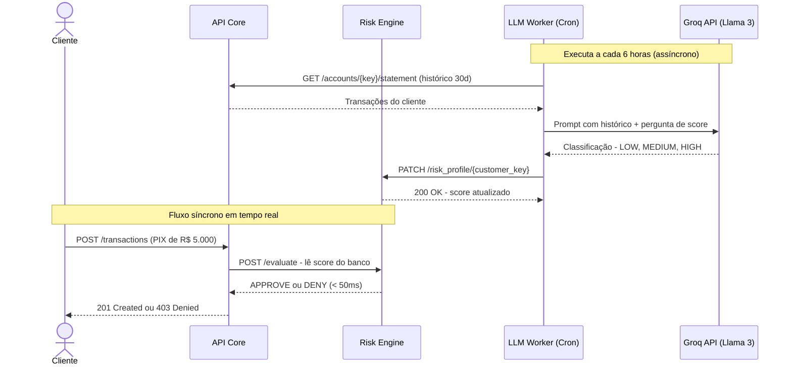
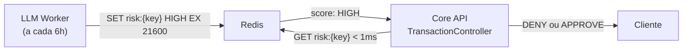

# RFC — Expansão: Operações de Crédito e Contas PJ

**TIME:** `[Seu Nome/Zumbão] e Equipe`
**DATA:** `26/09/2026`
**VERSÃO:** `1.0 (Draft Arquitetural)`

Este documento visa mapear as opções, impactos estruturais e pontos de conflito para a expansão do ecossistema bancário em duas frentes independentes: **Crédito/Cobrança** e **Pessoa Jurídica**. O foco é escalabilidade, isolamento de domínio (Clean Architecture) e performance sob alto volume transacional.

---

## 🏛️ FRENTE 1: Boletos e Empréstimos (Crédito e Tempo)

Esta frente introduz a variável "tempo" no sistema bancário (vencimentos, liquidação e juros), além de expor a API a concorrências assimétricas.

### 1.1 Domínio de Boletos
O boleto atua como um título de cobrança. Um cliente gera, e outro (ou uma instituição externa) paga.

#### Caminhos de Implementação
*   **Caminho A (Síncrono/Imediato):** No ato do pagamento do boleto, o sistema trava (Lock) a conta de quem paga e a de quem recebe, debitando de um e creditando no outro instantaneamente.
    *   *Conflito/Problema:* **Lock Contention** (Gargalo de contenção). Se um cliente PJ emite milhares de boletos (ex: conta de luz) e recebe centenas de pagamentos no mesmo minuto, a conta desse PJ sofrerá estrangulamento no banco de dados, enfileirando requisições e derrubando a API por *timeout*.
*   **Caminho B (Assíncrono/Event-Driven) - RECOMENDADO PARA ESCALA:** 
    *   O pagamento do boleto afeta instantaneamente apenas o **pagador** (garantindo que ele tem saldo).
    *   O sistema emite um evento (ex: via Kafka/RabbitMQ ou tabela Outbox) `BoletoPaidEvent`.
    *   Um *Worker* assíncrono processa essa fila e credita a conta do recebedor em *batches* (lotes) ou após a "compensação" (D+1, D+0). Isso dilui a carga no banco de dados do recebedor e imita o fluxo real da câmara de compensação financeira (CIP/Bacen).

### 1.2 Domínio de Empréstimos (Crédito)
A concessão cria dinheiro escritural atrelado a uma dívida fatiada em parcelas (`Installments`).

#### Caminhos de Implementação da Cobrança
*   **Caminho A (Cron Job Noturno Centralizado):** Um script acorda à meia-noite, varre a base buscando parcelas que vencem hoje, trava as contas e desconta os valores.
    *   *Conflito:* À medida que a base cresce para milhões de clientes, esse *job* vai sobrecarregar o SGBD.
*   **Caminho B (Particionamento e Cobrança Reativa) - RECOMENDADO:**
    *   **Particionamento:** Os *workers* de cobrança noturna lêem os clientes de forma segmentada (ex: por *shards* ou finais de ID) rodando em várias instâncias paralelas, reduzindo o impacto no banco.
    *   **Reatividade:** Se o cliente não tinha saldo à meia-noite, o status da parcela vira `OVERDUE` (Atrasada). Em vez de ficar tentando cobrar a cada hora, adiciona-se um gatilho de interceptação (*hook*) na rota de Depósitos/Transferências: **Sempre que um dinheiro entrar na conta**, o sistema verifica se há dívidas `OVERDUE` e já retém o valor instantaneamente.

---

## 🏢 FRENTE 2: Pessoa Jurídica (PJ e Estrutura de Identidade)

A entrada de empresas no sistema não muda o fato de que "Conta é Conta e Dinheiro é Dinheiro". O impacto mora na gestão de identidade e nas políticas de taxação.

### 2.1 Modelagem de Cliente (PF vs PJ)

#### Caminhos de Implementação
*   **Caminho A (Tabela Única com Nulls):** Adicionar campos no `CUSTOMER` atual: `type`, `cnpj`, `trade_name`, `partners`.
    *   *Conflito:* Fere a Clean Architecture. A tabela vai ficar repleta de colunas opcionais, misturando lógicas de pessoas que fazem aniversário com empresas que possuem regime tributário.
*   **Caminho B (Composição / Party Pattern) - RECOMENDADO:**
    *   Separação em tabelas distintas: `INDIVIDUAL_CUSTOMER` (Nome, CPF, Data de Nascimento) e `CORPORATE_CUSTOMER` (Razão Social, CNPJ).
    *   As duas tabelas herdam ou apontam para uma entidade centralizadora neutra: `PROFILE` ou `PARTY`.
    *   A tabela `ACCOUNT` abandona a chave estrangeira direta do cliente físico e passa a apontar para `PROFILE`. 
    *   *Integração:* Isso permite que, no futuro, um CPF seja dono de sua conta PF, mas também seja "sócio" com poder de transacionar na conta da sua PJ usando a mesma credencial de Login (via tabela de relacionamento `ACCOUNT_ACCESS`).

### 2.2 Motor de Tarifação Dinâmico
Como PJ geralmente paga por operações (como PIX) que são isentas para PF.

#### Caminhos de Implementação
*   **Caminho A (If/Else no Controller):** Fazer um *hardcode* no backend: `if account.customer.type == 'PJ': fee = 1.5`.
    *   *Conflito:* Desastroso para escala. Qualquer nova isenção promocional ou nova tarifa exige re-deploy (alteração no código-fonte) e correções massivas em testes unitários.
*   **Caminho B (Matriz de Políticas de Tarifa no Banco) - RECOMENDADO:**
    *   Refatorar a tabela `FEE` para uma tabela de relação, por exemplo, `FEE_POLICY`.
    *   A tabela guarda: `transaction_type` (ex: pix), `profile_type` (ex: corporate), `percentage` (1.50) e `fixed_amount` (R$ 0,00).
    *   *Integração:* No fluxo de transação (*Frente de Trabalho atual do Zumbão*), no exato momento antes de debitar o saldo, o sistema faz uma *query* rápida nessa matriz cruzando o tipo de conta que envia o dinheiro e o tipo da transferência. Isso permite isentar ou taxar sem nenhuma alteração de código, apenas populando o banco de dados.

---

## 🛰️ FRENTE 3: Módulos Satélites (Operação Desacoplada e Paralela)

Com o Core Bancário focado exclusivamente em manter a integridade do dinheiro e do cadastro (Ledger), certas features de alto impacto devem ser desenvolvidas em paralelo (por outras squads) utilizando uma arquitetura modular. Isso evita acoplamento pesado, não gera gargalos nos *Merge Requests* do time principal e permite escalar peças específicas sob demanda.

### 3.1 Motor de Notificações e Mensageria (Notification Hub)
Responsável por alertar o cliente (via Push, SMS, E-mail, WhatsApp) sobre transações, segurança e campanhas.

#### Caminhos de Implementação
*   **Caminho A (Chamadas Síncronas via Controller Core):** O próprio `TransactionController`, logo após o `COMMIT` da transferência no banco, executa um `send_email()`.
    *   *Conflito:* Acopla a infraestrutura de comunicação à lógica financeira. Se o provedor de e-mail (ex: SendGrid ou AWS SES) sofrer lentidão ou indisponibilidade, a transação bancária do cliente atrasa ou falha por *timeout*.
*   **Caminho B (Arquitetura Orientada a Eventos) - RECOMENDADO:**
    *   **Desacoplamento por Fila:** O Core Bancário conclui a transação e apenas publica um evento neutro (ex: `TransactionConfirmedEvent` em um *Broker* como RabbitMQ, Kafka ou mesmo uma tabela `OUTBOX`).
    *   **Consumo e Processamento:** A Squad de Notificações constrói um módulo (ou *worker*) totalmente independente que "escuta" essa fila. Ele possui seu próprio banco de dados com as preferências do cliente (ex: "Não me enviar SMS de madrugada") e templates. O core financeiro processa transações de forma ultrarrápida, enquanto a notificação é despachada na sequência em total segurança assíncrona.

### 3.2 Motor de Risco e Prevenção à Fraude (Anti-Fraud Engine)
Sistema que analisa a legitimidade de ações críticas em tempo real, mitigando golpes, invasões de conta e aplicando limites (ex: Limites Noturnos ou transferências atípicas).

#### Caminhos de Implementação
*   **Caminho A (Limites rígidos atrelados ao Domínio da Conta):** Adicionar campos mecânicos como `daily_limit` e `nightly_limit` na tabela `ACCOUNT` e espalhar `ifs` e condicionais ao longo do `AccountRepository`.
    *   *Conflito:* Fere violentamente o *Clean Code*. As regras e ameaças de fraude mudam diariamente. Se atrelarmos a Fraude ao Core, toda nova tática (ex: bloquear transferências rápidas seguidas na Black Friday) exigirá re-deploy e testes no "coração do dinheiro" do banco.
*   **Caminho B (Módulo Interceptor / Sidecar) - RECOMENDADO:**
    *   **Isolamento Analítico:** O Risco vira um módulo apartado. A Fraude gerencia suas próprias entidades (ex: `RISK_PROFILE`, `DEVICE_FINGERPRINT`, `LIMITS_POLICY`). A Squad pode construir análises de Machine Learning que consomem *Logs* baseados em banco NoSQL (Elasticsearch).
    *   **Integração por Delegação:** Antes de efetivar um débito, o Core Bancário delega a checagem passando o contexto (Origin, Destination, Amount, Time) para o Módulo de Risco. O motor responde de forma síncrona, porém extremamente rápida: `APPROVED`, `BLOCKED`, ou `CHALLENGE` (exigindo biometria ou token SMS).
    *   **Escala:** Dessa forma, a Squad de Prevenção à Fraude desenvolve, calibra pontuações de crédito, insere regras de *Anti-Money Laundering* (AML) e trabalha todos os dias no projeto sem nunca causar conflito com o time que desenvolve a concorrência do saldo.

---

## 🗺️ Roadmap de Entregáveis (O Caminho das Pedras)

Abaixo está o cronograma lógico de implementação para plugar essas expansões na aplicação atual com o menor atrito possível, fatiado por fases evolutivas.

### Fase 1: Preparação do Terreno (Refatoração de Domínio)
*Antes de criar produtos novos, o alicerce precisa ser ajustado para recebê-los.*

*   **Entregável 1.1: Refatoração da Tarifação (`FEE_POLICY`)**
    *   **Ação:** Criar a tabela `FEE_POLICY` para substituir o modelo rígido de `FEE`.
    *   **Integração:** Alterar o `TransactionController` (já existente) para, antes de debitar o saldo, buscar a tarifa no banco passando o tipo de transação (ex: pix) e o tipo de conta (ex: PF).
*   **Entregável 1.2: Abstração de Identidade (`PROFILE`)**
    *   **Ação:** Criar a tabela agnóstica `PROFILE` (ou `PARTY`) e ligar a tabela atual `CUSTOMER` a ela.
    *   **Integração:** Alterar a chave estrangeira em `ACCOUNT`, que hoje aponta para `customer_id`, para passar a apontar para `profile_id`. A rota atual `GET /accounts` continua funcionando perfeitamente, pois o JWT passará a resolver a identidade neutra.

### Fase 2: Lançamento Pessoa Jurídica (Frente 2)
*Com o terreno preparado, plugar a conta corporativa vira apenas um novo insert.*

*   **Entregável 2.1: Modelagem da Entidade PJ**
    *   **Ação:** Criação da entidade `CORPORATE_CUSTOMER` contendo `cnpj` e `company_name`, apontando para a abstração `PROFILE`.
*   **Entregável 2.2: Rota de Cadastro de Empresa**
    *   **Ação:** Criar `POST /corporate`.
    *   **Integração:** A partir do momento que o cadastro PJ ganha seu `PROFILE_ID`, **todas as rotas atuais já feitas** (criar conta, transferência, extrato) funcionam automaticamente para empresas, pois a arquitetura anterior já abstraiu quem é o dono.

### Fase 3: Motor de Empréstimos (Frente 1)
*Criando dinheiro no sistema bancário atrelado a dívidas.*

*   **Entregável 3.1: Concessão de Crédito**
    *   **Ação:** Modelar tabelas `LOAN` (contrato mestre) e `INSTALLMENT` (parcelas). Criar a rota de simulação e contratação.
    *   **Integração:** O motor de empréstimos utilizará as funções `credit` nativas da classe `AccountRepository` já existente para jogar o dinheiro na conta do cliente no momento da aprovação, registrando a operação como uma transação do tipo "crédito".
*   **Entregável 3.2: Rotina de Cobrança (Billing)**
    *   **Ação:** Criar o *Cronjob* ou Worker de cobrança diária.
    *   **Integração:** O serviço consumirá a classe `AccountRepository.debit` para descontar o saldo do cliente. Caso lance um erro `InvalidAmount` (sem saldo), o script de cobrança engole o erro e apenas altera o status da parcela para `OVERDUE`.

### Fase 4: Boletos e Cobrança
*Abrindo o banco para fluxos assimétricos de dinheiro (de terceiros para cá).*

*   **Entregável 4.1: Emissão de Boletos**
    *   **Ação:** Criar entidade `BOLETO` atrelada a uma `ACCOUNT` destino e a lógica de geração de linha digitável (algoritmo Módulo 10/11). Criar rota `POST /boletos`.
*   **Entregável 4.2: Liquidação de Boleto (Assíncrono)**
    *   **Ação:** Criar rota `POST /boletos/pay` (Simulando o sistema externo bancário).
    *   **Integração:** Como proposto, usaremos processamento assíncrono. O pagamento cai em uma fila. Um worker a consome e faz o acréscimo (`credit`) no SGBD da conta recebedora na "virada do dia", gerando um registro `TRANSACTION` de `type = boleto_compensation`.


---

## 🤖 MÓDULO SATÉLITE 3.3: Classificação de Risco via LLM (Async Worker)

### A Ideia
Em vez de limitar a análise de risco a regras estáticas e determinísticas (ex: "Valor > R$ 50 mil = DENY"), podemos enriquecer o sistema com um **Worker Assíncrono** que usa uma LLM para analisar o padrão comportamental completo do cliente (histórico de transações dos últimos 30 dias) e atualizar seu score de risco de forma proativa e periódica.

### Por que Assíncrono (e não Síncrono)?
LLMs gratuitas como **Groq** (Llama 3 / Mixtral) têm latência de 500ms a 3s por inferência. Modelos como o Gemini Free Tier chegam a 5-15s. Isso inviabiliza o uso no caminho direto da transação (que tem timeout de 2s). A solução é separar os dois tempos:

*   **Tempo Real (Síncrono):** O interceptor do `TransactionController` consulta o Risk Engine que apenas **lê** um `risk_score` pré-calculado. Resposta em < 50ms.
*   **Análise Profunda (Assíncrono):** Um Worker roda a cada X horas, alimenta a LLM com o histórico do cliente e **escreve** o novo score no banco do Risk Engine.



### Tecnologia e Modelo Recomendados
*   **Groq API (gratuita):** Usa os modelos `llama-3.1-8b-instant` ou `mixtral-8x7b`. Latência de ~400ms e generosa no plano free. API 100% compatível com o padrão OpenAI.
*   **Prompt de Classificação:**
    ```
    Você é um analista de risco bancário. Com base no histórico de transações
    abaixo, classifique o perfil do cliente como LOW, MEDIUM ou HIGH.
    Responda APENAS com uma dessas três palavras.

    Histórico: {transaction_summary}
    ```


---

## ⚡ CAMADA TRANSVERSAL: Redis como Read Model e Cache Distribuído

O Redis não é uma feature isolada — é uma **infraestrutura compartilhada** que melhora a performance e o desacoplamento de múltiplos módulos ao mesmo tempo. Uma única instância serve toda a stack.

### Casos de uso mapeados para ESTE projeto

#### 1. Score de Risco (Read Model — Risk Engine)
O uso primário que motivou a adoção. O LLM Worker calcula o score do cliente e escreve no Redis. O Core lê diretamente do cache, eliminando o HTTP síncrono ao Risk Engine no caminho da transação.



*   **Chave:** `risk:{customer_key}` (ex: `risk:a1b2c3d4-...`)
*   **TTL:** 6 horas (expira junto com o próximo ciclo do Worker)
*   **Fallback:** Se a chave expirou ou o Redis estiver fora, o Core consulta o Risk Engine via HTTP como hoje (degradação graciosa).

#### 2. Rate Limiting / Anti-Abuso (Core Bancário)
Controla quantas requisições um mesmo cliente pode fazer por janela de tempo, prevenindo abuso de endpoints críticos como `POST /auth/login` (brute-force de senha).

*   **Chave:** `rate:{endpoint}:{customer_key}` com TTL de 60s
*   **Valor:** contador atômico via `INCR` do Redis
*   **Lógica:** Se `INCR` retornar > 5 para `rate:login:{ip}`, a API retorna `429 Too Many Requests` sem nem checar o banco.

#### 3. Cache de Sessão / Blacklist de JWT (Auth)
Permite invalidar tokens JWT instantaneamente (ex: após troca de senha ou logout). Como JWT é stateless por definição, sem um blacklist externo é impossível revogar um token antes de expirar.

*   **Chave:** `blacklist:{jti}` (onde `jti` é o ID único do token)
*   **TTL:** Igual ao tempo de expiração restante do token
*   **Lógica:** O middleware JWT, após verificar a assinatura, checa se o `jti` existe no Redis. Se sim, rejeita com `401`.

#### 4. Cache de Tarifas (Fee Policy)
A tabela `FEE` raramente muda, mas é consultada em toda transferência. Um cache evita um `SELECT` ao banco para cada PIX feito.

*   **Chave:** `fee:{channel}` (ex: `fee:pix`, `fee:ted`)
*   **TTL:** 1 hora (tempo suficiente para refletir qualquer mudança tarifária)

### Infraestrutura

Um único container Redis compartilhado por toda a stack. Cada módulo usa um **prefixo de namespace** nas chaves para evitar colisões:

| Módulo         | Prefixo         | Exemplo                          |
| :------------- | :-------------- | :------------------------------- |
| Risk Engine    | `risk:`         | `risk:a1b2c3d4`                  |
| Rate Limiting  | `rate:`         | `rate:login:192.168.0.1`         |
| JWT Blacklist  | `blacklist:`    | `blacklist:jti-uuid-do-token`    |
| Fee Cache      | `fee:`          | `fee:pix`                        |

---

## 📋 STATUS DE IMPLEMENTAÇÃO DO RISK ENGINE

### O que já foi entregue (`feat/risk-api-module`)

*   **[DONE]** Estrutura do microsserviço (`risk_engine/`) criada no monorepo.
*   **[DONE]** Dockerfile e requirements espelhando os padrões do Core.
*   **[DONE]** Serviço `risk_engine` plugado no `docker-compose.yml` com healthcheck.
*   **[DONE]** Variável `RISK_ENGINE_URL` injetada no ambiente do Core via `docker-compose.yml`.
*   **[DONE]** Rota `POST /evaluate` com regra inicial (Amount > R$ 50k = DENY).
*   **[DONE]** Rota `GET /health_check` do microsserviço.
*   **[DONE]** `RiskEngineConnector` criado em `src/connectors/` seguindo o padrão arquitetural do Core.
*   **[DONE]** `RiskEngineDenied` (erro `QIT009001`) registrado em `src/errors/custom_errors.py`.
*   **[DONE]** `TransactionController` integrado ao conector (intercepta toda transação antes do débito).

### Próximos Passos (Backlog Priorizado)

*   **[TODO - Alta Prioridade]** Modelar e criar a tabela `RISK_PROFILE` no banco de dados do Risk Engine (campos: `customer_key`, `risk_score`, `reason`, `last_evaluated_at`).
*   **[TODO - Alta Prioridade]** Refatorar o `POST /evaluate` para consultar o `risk_score` da tabela `RISK_PROFILE` em vez de usar a regra hardcoded de valor.
*   **[TODO - Alta Prioridade]** Criar a rota interna `PATCH /risk_profile/{customer_key}` para o Worker LLM atualizar o score.
*   **[TODO - Média Prioridade]** Construir o LLM Worker (`risk_engine/worker/llm_classifier.py`) usando a biblioteca `groq` para consumir a API gratuita.
*   **[TODO - Média Prioridade]** Configurar o Cron Job do Worker (via `APScheduler` ou `cron` no Docker) para rodar a classificação a cada 6 horas.
*   **[TODO - Baixa Prioridade]** Criar rota `GET /risk_profile/{customer_key}` para auditoria interna (visualizar o score atual de um cliente).
*   **[TODO - Baixa Prioridade]** Escrever testes de integração para o conector (`test_risk_engine_connector.py`) cobrindo os cenários de APPROVE, DENY e Fail-Open.
