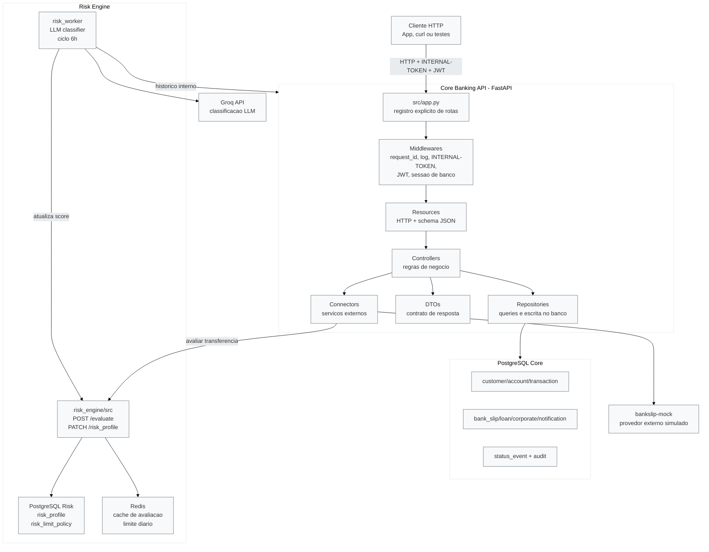
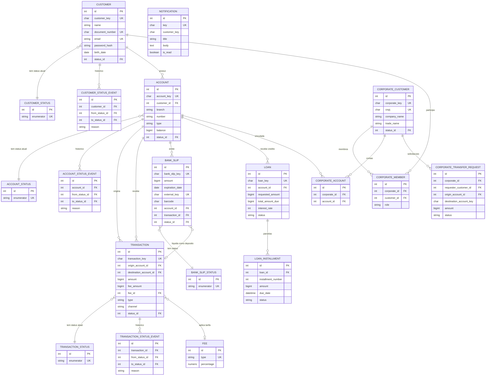
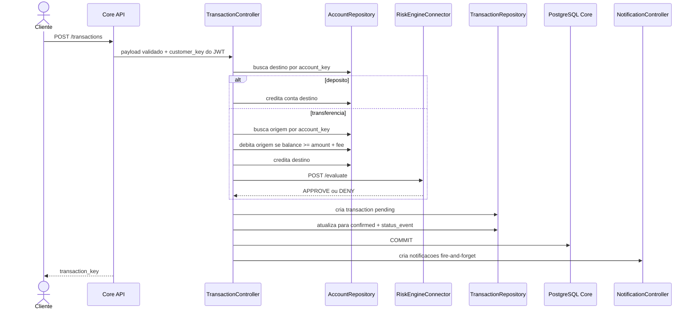
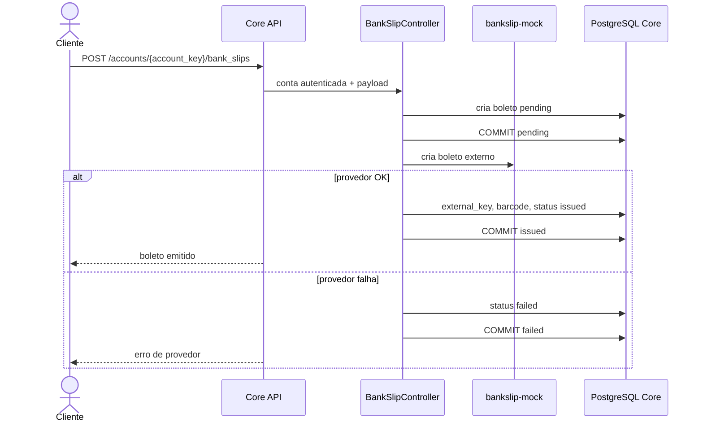
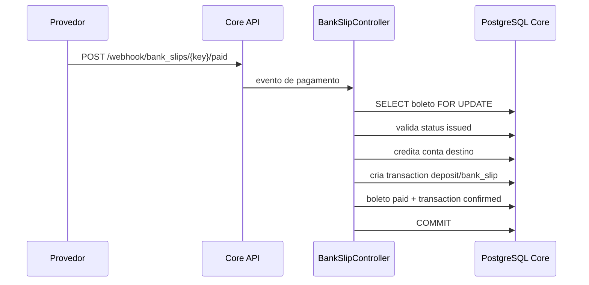
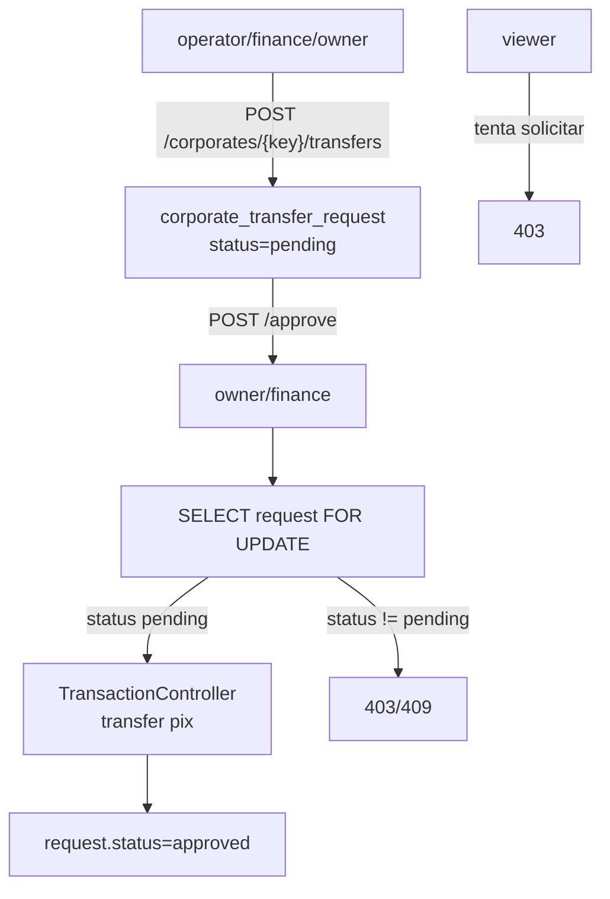
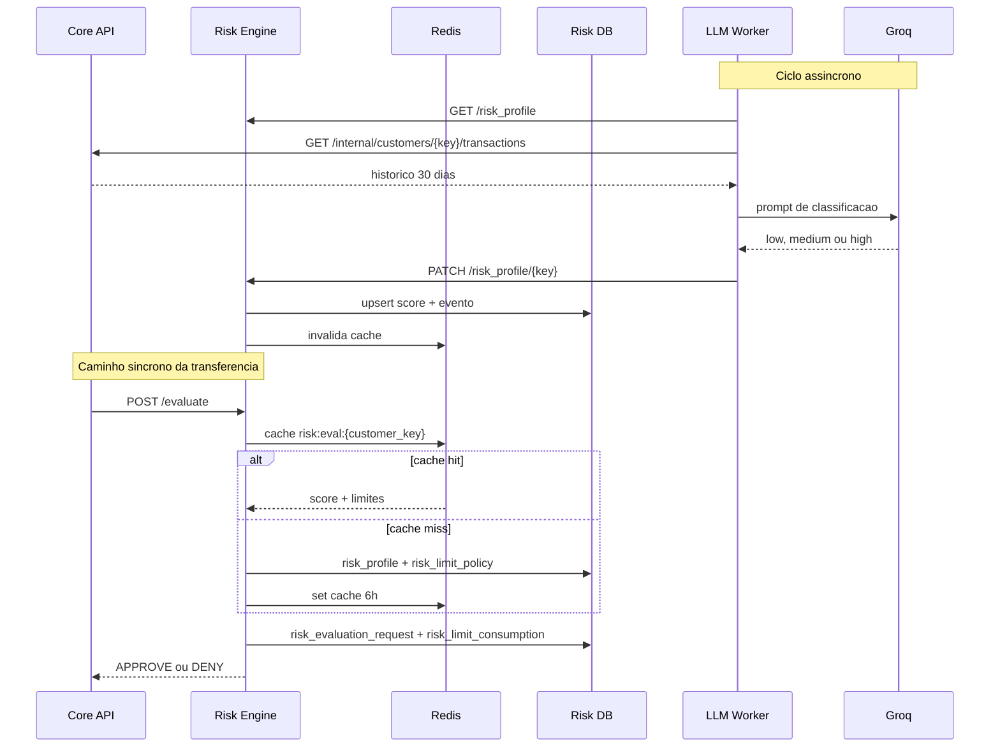

# RFC - Fundamentacao tecnica da plataforma bancaria

**TIME:** Bootcamp QI Tech G33  
**DATA:** 03/10/2026  
**VERSAO:** 1.0  
**STATUS:** Draft para alinhamento tecnico

Este documento fundamenta as decisoes tecnicas observadas no repositorio atual e organiza os pontos que precisam ser levados ao time. O objetivo nao e vender uma arquitetura idealizada: e explicar o que o codigo faz hoje, por que essas escolhas fazem sentido para um prototipo bancario, quais riscos foram mitigados e quais riscos ainda estao abertos.

---

## 1. Contexto

O projeto implementa uma API bancaria em Python + FastAPI com PostgreSQL, Docker Compose e uma separacao explicita por camadas: resources, controllers, repositories, models, dtos, middlewares, connectors e errors.

O dominio ja cobre:

| Dominio | O que existe hoje |
|---|---|
| Clientes PF | Cadastro, autenticacao, status e historico de status |
| Contas | Criacao, consulta, saldo, extrato, bloqueio, desbloqueio e encerramento |
| Transacoes | Deposito, transferencia, tarifa, status e historico |
| Boletos | Emissao via provedor externo mockado, webhook de pagamento e liquidacao como deposito |
| Emprestimos | Simulacao, contratacao, desembolso e pagamento manual de parcela |
| Pessoa Juridica | Cadastro PJ, membros, papeis, conta PJ e fluxo de transferencia por aprovacao |
| Notificacoes | Escrita interna de eventos de notificacao apos transacoes e mudancas de conta |
| Risco | Microsservico dedicado, banco proprio, Redis e worker assincrono de classificacao por LLM |

O criterio principal do desenho e proteger o dinheiro. Em termos praticos, isso significa:

- dinheiro sempre representado em centavos;
- escrita de saldo feita no banco, nao em memoria;
- status rastreaveis por eventos;
- autorizacao baseada no cliente autenticado, nao em campos livres do payload;
- conectores externos isolados da regra de negocio;
- modulo de risco separado do core transacional.

---

## 2. Mapa macro da aplicacao

### Decisao fundamentada

O sistema foi organizado como um monorepo de servicos Docker em vez de uma aplicacao unica que faz tudo dentro do mesmo processo. O core conserva a responsabilidade sobre cadastro, contas e ledger. O risk engine tem banco proprio e Redis proprio, e o worker LLM roda fora do caminho sincrono da transacao.

**Por que isso e adequado:** avaliacao antifraude muda com frequencia maior que o ledger. Separar risco reduz o risco de mexer no "coração do dinheiro" a cada ajuste de politica, score ou fornecedor de IA.

**Trade-off aceito:** aumenta a quantidade de componentes locais no `docker-compose.yml`. Para bootcamp isso aumenta a superficie de setup, mas ensina uma divisao mais parecida com servicos reais.

---

## 3. Modelo de dados consolidado

### Decisao fundamentada

O modelo usa identificadores internos sequenciais para relacionamento e chaves publicas `*_key` para exposicao via API. Isso mantem joins simples no banco e evita expor volumetria por IDs sequenciais.

O saldo de conta e os valores transacionais sao `BIGINT`, representando centavos. Essa decisao e correta para dinheiro porque evita erro de arredondamento de ponto flutuante e simplifica comparacoes como "saldo >= valor".

O banco tambem cria tabelas de status e eventos de status para entidades centrais. Essa escolha sustenta auditoria: uma entidade nao apenas "esta" em um estado, ela deixa uma trilha de como chegou la.

---

## 4. Fluxo de transacao financeira

### Decisoes fundamentadas

**Debito condicional direto no banco.** O `AccountRepository.debit` atualiza saldo com filtro `balance >= amount`. Isso evita o padrao inseguro "ler saldo em Python, decidir em memoria e salvar depois". Em concorrencia, a decisao precisa acontecer no banco.

**Risco como sidecar sincrono.** Transferencias passam pelo risk engine antes do commit. A decisao foi separar regra antifraude do core e preservar o rollback da sessao caso o motor negue.

**Notificacao fire-and-forget.** Notificacao acontece depois do commit e nao quebra a transacao se falhar. Isso protege a experiencia financeira: provedor de comunicacao ou escrita de notificacao nao deve desfazer dinheiro ja confirmado.

### Trade-off relevante

Hoje o risco e chamado depois de `debit` e `credit`, mas antes do `commit`. Funciona se a sessao fizer rollback corretamente em qualquer negacao ou timeout acima do limite degradado. Ainda assim, do ponto de vista de clareza operacional, e mais facil raciocinar se a avaliacao de risco acontecer antes da mutacao de saldo, com uma estrategia separada para nao consumir limite de risco em transacao que falharia por saldo.

---

## 5. Fluxo de boleto

### Decisao fundamentada

O boleto e gravado como `pending` antes da chamada externa. Isso preserva rastreabilidade mesmo se o provedor cair: a API consegue marcar `failed` e explicar o motivo.

No pagamento, a busca usa lock pessimista (`FOR UPDATE`) no boleto. Essa decisao e correta porque webhooks externos podem repetir eventos. O lock serializa avisos simultaneos e evita pagar o mesmo boleto duas vezes.

### Trade-off relevante

O commit antes da chamada externa melhora auditabilidade, mas abre uma janela de consistencia eventual: existe boleto local `pending` sem registro externo enquanto a chamada nao termina. Para o escopo atual isso e aceitavel. Em producao, a recomendacao seria outbox ou reconciliacao periodica de boletos pendentes.

---

## 6. Fluxo PJ

```mermaid
stateDiagram-v2
    direction LR
    [*] --> EmpresaCriada: POST /corporates
    EmpresaCriada --> MembroAdicionado: owner adiciona finance/operator/viewer
    MembroAdicionado --> ContaAberta: owner/finance cria conta
    ContaAberta --> TransferenciaPendente: owner/finance/operator solicita
    TransferenciaPendente --> TransferenciaAprovada: owner/finance aprova
    TransferenciaAprovada --> [*]: dinheiro movimentado
```

### Decisao fundamentada

O desenho PJ nao cria um novo tipo de saldo. A conta PJ ainda e uma `account`; a empresa e ligada a ela por `corporate_account`, e as permissoes ficam em `corporate_member`.

Essa composicao e boa porque evita duplicar ledger. Dinheiro continua sendo dinheiro: o que muda e o modelo de autorizacao.

### Trade-off relevante

Na implementacao atual, a conta PJ e aberta usando o `AccountController` de uma pessoa fisica autorizada, e a transferencia aprovada chama `TransactionController` usando a chave do dono tecnico da conta. Isso reaproveita o core, mas cria uma fronteira conceitual fragil: a posse real e da empresa, enquanto a autorizacao operacional passa por uma pessoa dona da conta criada. Para evoluir, o ideal e introduzir uma abstracao de titularidade neutra (`party`, `profile` ou `account_holder`) em vez de manter `account.customer_id` como dono universal.

---

## 7. Fluxo de risco e LLM

### Decisao fundamentada

O LLM nao esta no caminho sincrono de transferencia. Isso e essencial: classificacao por IA tem latencia, custo, instabilidade e dependencia externa. O worker roda periodicamente, atualiza `risk_profile`, e o core usa o risk engine para uma decisao rapida baseada em score e politica de limites.

O Redis cumpre um papel principal e um papel auxiliar:

- cache de avaliacao por cliente, evitando consulta repetida ao Postgres de risco;
- read model auxiliar de consumo diario, reconstruivel a partir de `risk_limit_consumption`.

### Trade-off relevante

O consumo de limite agora e persistido em `risk_limit_consumption` com status inicial `reserved`, e o Core confirma a avaliacao apos o commit financeiro. Isso resolve o problema de Redis como unica memoria do consumo e torna `/evaluate` idempotente por `evaluation_key`.

O risco residual e operacional: se a confirmacao pos-commit falhar, a reserva fica pendente. O proximo passo e uma reconciliacao periodica que expire reservas antigas ou cruze `transaction_key` com o ledger.

---

## 8. Decisoes tecnicas e justificativas

| Decisao | Onde aparece | Fundamento | Risco residual |
|---|---|---|---|
| Separar resource, controller, repository, model e dto | `src/` | Mantem HTTP, regra, banco e resposta em responsabilidades diferentes | Alguns controllers ainda acessam ORM direto, principalmente emprestimos |
| Usar `INTERNAL-TOKEN` e JWT | middlewares + resources | Protege API por token interno e identifica cliente autenticado por JWT | Defaults em compose sao bons para estudo, mas nao para ambiente real |
| Valores monetarios em `BIGINT` | schema core | Evita erro de float e representa centavos | Tarifas usam `NUMERIC(5,2)` e a conta mistura `Decimal` com `int` |
| Debito condicional no banco | `AccountRepository.debit` | Evita saldo negativo sob concorrencia | Transferencia credita antes de debitar em um dos ramos de ordenacao |
| Eventos de status | tabelas `*_status_event` | Auditoria e rastreabilidade | Nem todo dominio novo segue o mesmo padrao ainda, ex.: loan usa status textual |
| Risco como servico separado | `risk_engine/` + compose | Politicas antifraude evoluem sem mexer no core | Dependencia sincrona exige fallback bem definido |
| Worker LLM assincrono | `risk_engine/worker` | Remove latencia/custo de IA do caminho critico | Score pode ficar defasado ate o proximo ciclo |
| Redis para cache/read model | `risk_engine/src/connectors/redis_connector.py` | Reduz latencia e carga no Postgres de risco | Consumo verdadeiro fica em `risk_limit_consumption`; reservas antigas ainda precisam reconciliacao |
| Notificacao pos-commit | `NotificationController` chamado apos transacao/conta | Comunicacao nao deve quebrar movimento financeiro | Notificacao ainda escreve no mesmo banco do core, nao e outbox real |
| Conta interna de tesouraria | schema core + `get_bank_account` | Centraliza tarifas e pagamento de parcelas | Conta interna precisa ser tratada como entidade sistemica, nunca login operacional |

---

## 9. Pontos criticos para levar ao time

### P0 - Transferencia PJ deve quebrar ao criar auditoria

O metodo `CorporateRepository.create_audit` atribui `audit.author_id` e `audit.metadata`, mas o model `CorporateAudit` define `actor_customer_id` e nao define coluna `metadata`. O schema tambem nao tem coluna `metadata`.

Impacto esperado: solicitar ou aprovar transferencia PJ tende a resultar em erro de atributo no Python ou falha de persistencia, justamente no fluxo que deveria auditar a operacao.

Recomendacao:

- trocar `author_id` por `actor_customer_id`;
- decidir se `metadata` deve existir; se sim, adicionar coluna no schema e model;
- cobrir com teste que crie uma solicitacao PJ e valide uma linha em `corporate_audit`.

### P0 - Testes PJ nao puderam validar porque a API nao estava de pe

Ao rodar `./.venv/bin/python -m pytest tests/integration/pj/test_corporate_transfer_rules.py -q`, todos os testes falharam por API offline em `http://0.0.0.0:3000`.

Isso nao prova falha funcional do fluxo, mas impede validar o modulo neste momento. O time precisa subir `docker compose up` e repetir os testes PJ antes de considerar a RFC como validada.

### P1 - Ordem da avaliacao de risco em transferencia precisa ser fechada como decisao

Hoje o core altera saldo em sessao e depois chama risco antes do commit. A aposta e: se o risco negar, a excecao aciona rollback e desfaz as mutacoes.

Essa decisao e tecnicamente defensavel, mas sensivel. O time deve escolher e documentar uma politica:

- manter risco depois das validacoes de saldo para evitar "ghost spend" no Redis;
- ou mover risco para antes da mutacao de saldo e criar reserva/confirmacao/estorno de limite.

O ponto importante e evitar uma zona cinzenta onde o Redis consome limite, o banco volta saldo e ninguem reconcilia.

### P1 - Modulo de emprestimos ainda nao segue o mesmo padrao de maquina de estados

Emprestimos e parcelas usam strings diretas (`active`, `paid`, `pending`) em vez de tabela de status + eventos. Para prototipo funciona, mas foge do padrao de auditoria usado em cliente, conta, transacao e boleto.

Recomendacao:

- criar `loan_status`, `loan_status_event`, `loan_installment_status` e `loan_installment_status_event`;
- registrar evento na contratacao, pagamento de parcela, atraso e quitacao;
- evitar que cobranca futura dependa de string solta espalhada no controller.

### P1 - Conta PJ ainda depende de `account.customer_id`

A empresa se vincula a uma conta por `corporate_account`, mas a conta continua tendo `customer_id` obrigatorio. Isso faz a conta PJ nascer associada a uma PF que executou a abertura.

Para bootcamp, o reuso simplifica a entrega. Para evolucao, o time deve planejar `account_holder` neutro, permitindo PF e PJ como titulares sem "dono tecnico" escondido.

### P2 - Boleto tem consistencia eventual sem reconciliacao

A emissao cria boleto `pending`, faz commit, chama provedor e depois marca `issued` ou `failed`. Se o processo cair entre commit local e resposta do provedor, o boleto pode ficar pendente indefinidamente.

Recomendacao:

- criar job de reconciliacao de boletos `pending`;
- ou adotar outbox/estado `registering` com retry idempotente.

### P2 - Notificacao ainda nao e modulo desacoplado de verdade

A documentacao e o desenho apontam para notificacao por eventos, mas hoje `NotificationController` escreve direto no banco do core apos o commit.

Isso e aceitavel como primeiro passo porque isola a chamada atras de `publish_event`. A evolucao natural e trocar a implementacao por outbox, fila ou Redis stream sem mudar os chamadores.

---

## 10. Backlog recomendado

| Prioridade | Item | Resultado esperado |
|---|---|---|
| P0 | Corrigir `CorporateAudit` e rodar testes PJ com API ligada | Transferencia PJ auditavel e validada |
| P0 | Executar suite critica: transacao, boleto, loan, risk e PJ | Evidencia objetiva antes de demo |
| P1 | Criar reconciliacao de reservas de risco antigas | Sem limite preso quando confirmacao pos-commit falhar |
| P1 | Formalizar titularidade neutra de conta | Evolucao limpa para PF/PJ |
| P1 | Adicionar status/eventos para loan/installment | Auditoria consistente no dominio de credito |
| P2 | Criar reconciliacao de boletos pendentes | Menos estados presos por falha externa |
| P2 | Evoluir notificacoes para outbox/fila | Core financeiro menos acoplado |
| P2 | Revisar defaults secretos no compose para perfil nao-local | Evitar vazamento de configuracao insegura |

---

## 11. Conclusao

A arquitetura atual esta bem encaminhada para um prototipo bancario com preocupacao real de integridade: separa camadas, usa transacao relacional, evita float para dinheiro, rastreia status, isola risco e coloca IA fora do caminho critico.

As decisoes mais fortes sao:

- **ledger no PostgreSQL como fonte de verdade;**
- **risco como modulo separado;**
- **Redis como read model/limite operacional, nao como fonte definitiva de dinheiro;**
- **contas, boletos, emprestimos e PJ reutilizando o mesmo mecanismo de saldo;**
- **auditoria por eventos onde o dominio ja esta maduro.**

O ponto que merece atencao imediata e PJ: existe um desalinhamento concreto entre repository, model e schema de auditoria. Depois disso, os maiores riscos deixam de ser "bug de linha" e viram decisoes arquiteturais: titularidade PF/PJ, reconciliacao de boleto, consumo de limite de risco e padronizacao de estados no credito.
