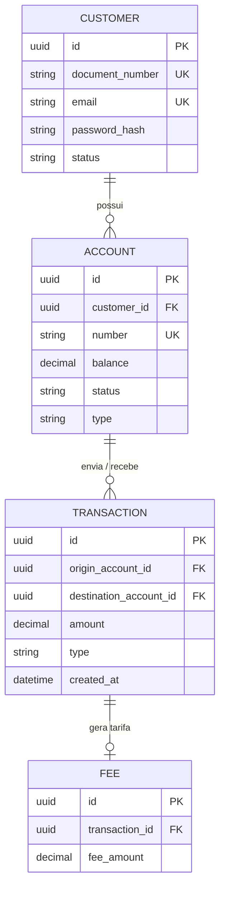
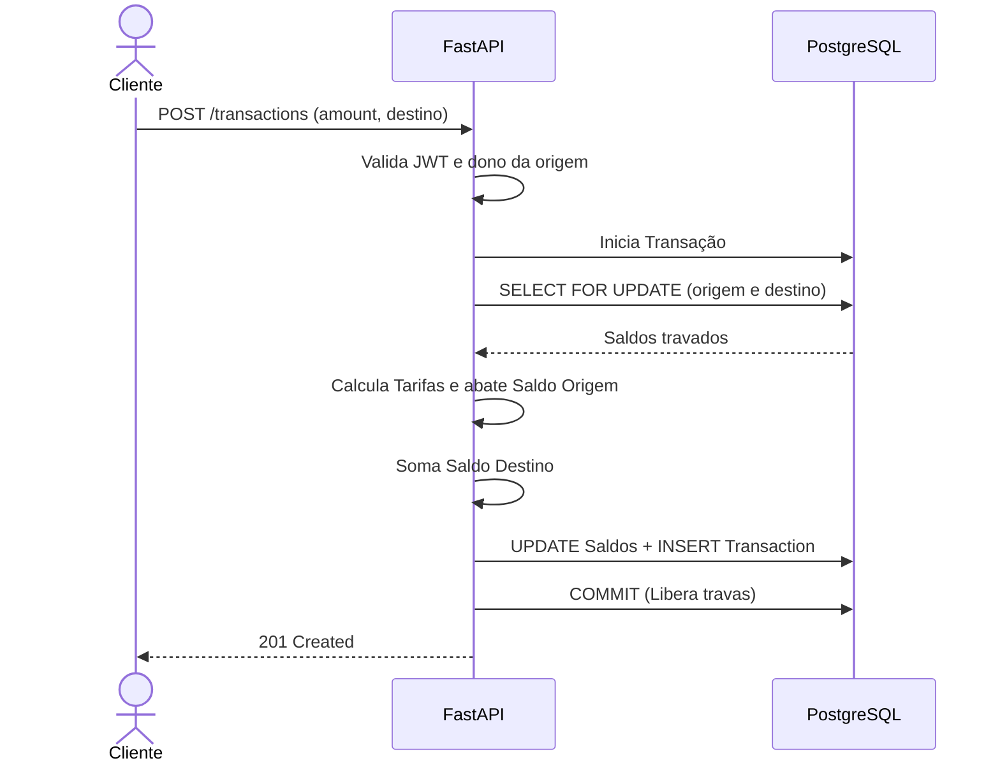

# RFC — Desenho da API Bancária (Protótipo)

**TIME** `tea · zumbao`
**DATA** `26/09/2026`
**VERSÃO** `1`

---

> 💡 **Orientação Visual:**
> Durante o desenho e implementação destas etapas, **abusemos do uso de diagramas (especialmente Mermaid)**! O uso de esquemas visuais (como diagramas de sequência, Entidade-Relacionamento e fluxo) facilita imensamente a validação da lógica de negócio e o entendimento do projeto.

---

## 🏗️ FRENTE DE TRABALHO 1: Contexto e Modelo de Dados (Responsável: tea)

### Contextualização

#### Entendendo o problema
O sistema é um protótipo de banco digital que precisa oferecer operações financeiras básicas de forma segura e consistente, lidando com o desafio crítico de manter a integridade do dinheiro.
* **Operações oferecidas:** Cadastro e autenticação (login) de clientes, criação de contas, depósitos, transferências (PIX, TED, Internacional) com cobrança de tarifas, e geração de extrato.
* **Garantias em cima do dinheiro:** O sistema precisa garantir o princípio ACID. O dinheiro não pode ser criado (exceto por depósito), duplicado ou perdido. Se houver concorrência (várias transferências simultâneas) e der errado, podemos ter saldo divergente (negativo), transações duplicadas ou dinheiro trocando de mãos sem o devido bloqueio de registro.
* **Fora de escopo desta entrega:** Pix copia-e-cola, Boletos, Empréstimos e contas PJ (Pessoa Jurídica).

#### Explicando a solução de forma macro
A solução foi construída utilizando **Python com FastAPI, SQLAlchemy (ORM) e PostgreSQL**, rodando em contêineres **Docker**. A segurança e identificação dos usuários baseia-se exclusivamente em tokens JWT. Para garantir a integridade do dinheiro, o sistema deve utilizar controle transacional relacional para as operações de débito e crédito, isolando o estado da conta a cada requisição.

* `<Controle de saldo em memória / Python>` — Descartada porque causaria *Race Conditions* e deixaria saldos inconsistentes em um ambiente de concorrência real. Ganharia se a API fosse um sistema monolítico bloqueante operando em *single-thread*.

### Banco de Dados (Somente diagrama)
*(Nesta seção, crie o modelo completo de entidades. Foco no que garante unicidade e guarda o estado.)*

---

## 🛤️ FRENTE DE TRABALHO 2: Rotas e Fluxos (Responsável: zumbao)

### Implementação

#### Rotas
| MÉTODO | CAMINHO | O QUE FAZ | ENTRADA (CAMPOS QUE IMPORTAM) | SAÍDAS (STATUS E QUANDO) |
| :--- | :--- | :--- | :--- | :--- |
| POST | `/customers` | Cria o cliente | `document_number`, `email`, `password` | 201 criado; 409 CPF/email já existe; 422 dados inválidos |
| POST | `/auth/login` | Autentica cliente | `document_number`, `password` | 200 retorna JWT; 401 senha/hash inválidos |
| POST | `/customers/{key}/accounts` | Abre nova conta | `type` | 201 criada; 401 sem JWT; 422 > 3 contas ativas |
| GET | `/accounts` | Lista contas (idempotente) | JWT do Header | 200 listagem do cliente logado |
| POST | `/transactions` | Faz transferência | `type`, `amount`, `destination_account_key` | 201 transferido; 403 origem de outro; 422 sem saldo |
| GET | `/accounts/{key}/statement` | Extrato (idempotente)| `limit`, `page` | 200 devolve paginado; 400 período invertido |

#### Fluxos

**Transação de Transferência — Caminho Feliz**

**Transação de Transferência — Falha: Saldo Insuficiente**
1. O Cliente faz o request e o JWT é validado.
2. A transação inicia e as linhas são travadas no Banco de Dados.
3. O sistema calcula a tarifa da transferência e avalia: `Saldo Origem < (Valor + Tarifa)`.
4. Ocorre um `ROLLBACK` no banco, cancelando e soltando todas as travas imediatamente.
5. A API retorna `422 Unprocessable Entity` para o cliente.

> ### Principal desafio
> * **Qual é:** Concorrência no controle de saldo.
> * **Por que é difícil:** Requisições simultâneas lendo o mesmo saldo ao mesmo tempo geram estado fantasma, permitindo aprovar múltiplas transferências com dinheiro que não existe.
> * **Como o desenho resolve:** Através do isolamento transacional com *Pessimistic Locking* no Banco de Dados (`SELECT ... FOR UPDATE`), enfileirando requisições concorrentes diretamente no SGBD antes de ler o saldo real.
