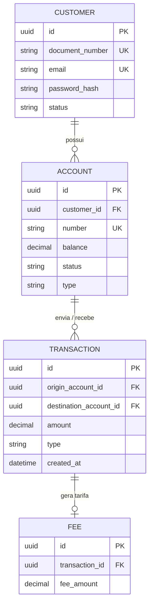
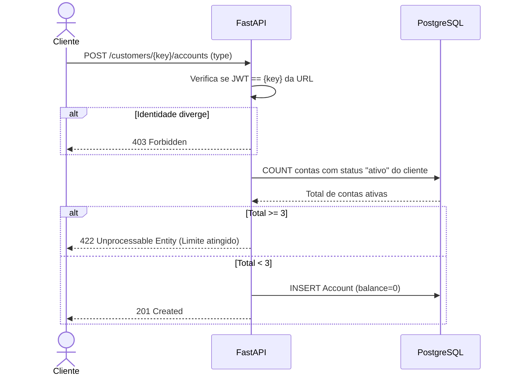

# RFC — Desenho da API Bancária (Protótipo)

**TIME** `tea · zumbao`
**DATA** `26/09/2026`
**VERSÃO** `1`

---

> 💡 **Orientação Visual:**
> Durante o desenho e implementação destas etapas, **abusemos do uso de diagramas (especialmente Mermaid)**! O uso de esquemas visuais (como diagramas de sequência, Entidade-Relacionamento e fluxo) facilita imensamente a validação da lógica de negócio e o entendimento do projeto.

---

## 🏗️ FRENTE DE TRABALHO 1: Contexto e Modelo de Dados (Responsável: tea)

### Contextualização

#### Entendendo o problema
O sistema é um protótipo de banco digital que precisa oferecer operações financeiras básicas de forma segura e consistente, lidando com o desafio crítico de manter a integridade do dinheiro.
* **Operações oferecidas:** Cadastro e autenticação (login) de clientes, criação de contas, depósitos, transferências (PIX, TED, Internacional) com cobrança de tarifas, e geração de extrato.
* **Garantias em cima do dinheiro:** O sistema precisa garantir o princípio ACID. O dinheiro não pode ser criado (exceto por depósito), duplicado ou perdido. Se houver concorrência (várias transferências simultâneas) e der errado, podemos ter saldo divergente (negativo), transações duplicadas ou dinheiro trocando de mãos sem o devido bloqueio de registro.
* **Fora de escopo desta entrega:** Pix copia-e-cola, Boletos, Empréstimos e contas PJ (Pessoa Jurídica).

#### Explicando a solução de forma macro
A solução foi construída utilizando **Python com FastAPI, SQLAlchemy (ORM) e PostgreSQL**, rodando em contêineres **Docker**. A segurança e identificação dos usuários baseia-se exclusivamente em tokens JWT. Para garantir a integridade do dinheiro, o sistema deve utilizar controle transacional relacional para as operações de débito e crédito, isolando o estado da conta a cada requisição.

* `<Controle de saldo em memória / Python>` — Descartada porque causaria *Race Conditions* e deixaria saldos inconsistentes em um ambiente de concorrência real. Ganharia se a API fosse um sistema monolítico bloqueante operando em *single-thread*.

### Banco de Dados (Somente diagrama)
*(Nesta seção, crie o modelo completo de entidades. Foco no que garante unicidade e guarda o estado.)*

---

## 🛤️ FRENTE DE TRABALHO 2: Rotas e Fluxos (Responsável: zumbao)

### Implementação

#### Rotas
| MÉTODO | CAMINHO | O QUE FAZ | ENTRADA (CAMPOS QUE IMPORTAM) | SAÍDAS (STATUS E QUANDO) |
| :--- | :--- | :--- | :--- | :--- |
| **POST** | `/customers/{key}/accounts` | Abre nova conta no perfil do cliente | `type` (checking ou savings) | **201:** Conta criada. **401:** Faltou JWT na requisição. **403:** Tentou abrir conta no perfil de outro cliente. **422:** Cliente já possui 3 contas ativas ou enviou tipo inválido. |
| **GET** | `/accounts` | Lista contas do próprio cliente (Idempotente) | *Sem payload.* (A identidade vem do Header `JWT`) | **200:** Lista retornada com sucesso (nunca exibe contas de terceiros). *(Idempotente pois requisições repetidas não alteram estado e retornam a mesma lista se não houverem novas aberturas)* |
| **GET** | `/accounts/{key}` | Exibe detalhes de uma conta (Idempotente) | `key` (via Path) | **200:** Detalhes exibidos. **403:** Conta não pertence ao cliente do JWT. **404:** Conta inexistente. *(Idempotente pois trata-se de leitura restrita)* |
| **POST** | `/transactions` | Efetua transferência ou depósito | `type` (pix, ted, deposit), `amount`, `destination_account_key` | **201:** Transação efetivada. **403:** Tentativa de débito em conta origem de outro cliente. **422:** Saldo insuficiente, valor inválido ou conta destino bloqueada/inexistente. |
| **GET** | `/accounts/{key}/statement` | Emite o extrato paginado (Idempotente) | `limit`, `page` | **200:** Extrato devolvido. **403:** Tentou consultar extrato de outro cliente. **400:** Data de início maior que a de fim, ou limitador inválido. *(Idempotente pois paginação e filtros estáticos na URL sempre geram o mesmo recorte do histórico)* |

> **Nota de Segurança e Identidade:** O payload de `/transactions` **não** recebe a `origin_account_key`, e o extrato não aceita busca livre. A identidade do cliente que executa a operação é inferida **sempre** pelo token JWT (blindando vazamento horizontal).

#### Fluxos

**1. Fluxo Lógico de Abertura de Conta**
Este fluxo ilustra a regra de negócio para limitação de contas, avaliando o limite de 3 contas ativas por perfil:

**2. Fluxo de Consulta de Extrato (Paginação e Segurança)**
A rota de extrato não requer isolamento transacional (*lock* de banco) pois trata-se de uma leitura idempotente, focada em segurança de acesso:

1. **Recepção:** O cliente solicita `GET /accounts/{key}/statement?limit=10&page=1`.
2. **Autorização JWT:** A API extrai o dono da requisição do JWT. Caso a conta alvo `{key}` não pertença ao cliente autenticado, a API barra imediatamente com `403`.
3. **Consulta de Histórico:** O sistema busca no banco transações onde a conta seja `origin_account_id` **OU** `destination_account_id`.
4. **Paginação:** Aplica-se ordenação decrescente por data (`created_at`). Baseado no `limit` e no *offset* (calculado via `page`), o sistema formata o retorno.
5. **Retorno:** O cliente recebe `200 OK` com o histórico e a consistência das flags de navegação (como `is_last_page`).

**3. Fluxo Lógico de Depósito**
Diferente da transferência, o depósito é uma operação unilateral (sem conta de origem) e o único momento onde fundos são inseridos organicamente no sistema.

* **Caminho Feliz:**
  1. A API recebe `POST /transactions` com `type: deposit`, o valor (`amount > 0`) e a conta alvo.
  2. Verifica-se o status da conta. Sendo `active`, a transação de banco é iniciada.
  3. O PostgreSQL soma o saldo e registra a linha na tabela `Transaction` (com `origin_account_id` como Nulo). 
  4. Ocorre o Commit e o cliente recebe 201.
* **Caminho de Falha (Conta Inválida/Bloqueada):**
  1. O payload é aceito pelo Schema, mas o código avalia que o status da conta no SGBD é `blocked` ou `closed`.
  2. Nenhum `UPDATE` de saldo ou `INSERT` de histórico é gerado.
  3. A API aborta o fluxo e retorna `422 Unprocessable Entity` informando o status inválido da conta.

**4. Fluxo de Transferências e Tarifas**
> 🚧 **[EM ABERTO - DEPENDE DA IMPLEMENTAÇÃO]**
> *Os fluxogramas exatos de transferência (incluindo cálculo dinâmico e roteamento das tarifas de TED/PIX) estão pausados. Eles serão detalhados aqui após validarmos a ordem de travamento dos saldos no código real.*

> ### Principal desafio
> * **Qual é:** Integridade transacional e *Race Conditions* (Condições de Corrida) no controle do saldo bancário.
> * **Por que é difícil:** Se ocorrerem 20 transferências simultâneas de R$ 100 em uma conta que tem apenas R$ 1.000, o ORM na camada de aplicação (Python) tende a ler o saldo "R$ 1.000" para todas as 20 requisições simultaneamente, antes que qualquer abatimento de fato termine. Com isso, o sistema aprova as transações baseado num "saldo fantasma", concluindo todas elas e negativando a conta (criando dinheiro irreal) sem acionar o validador.
> * **Como o desenho resolve:** Através do isolamento transacional utilizando **Pessimistic Locking**. A transação inicia um `SELECT ... FOR UPDATE` ordenando os IDs das contas envolvidas para evitar *deadlocks*. Esse mecanismo obriga o banco de dados (PostgreSQL) a formar uma "fila de espera": a segunda requisição concorrente só conseguirá ler o saldo e operar depois que a primeira descontar o valor e soltar a linha (dar o `COMMIT`). Isso barra gastos indevidos assim que o dinheiro real bate em zero.
