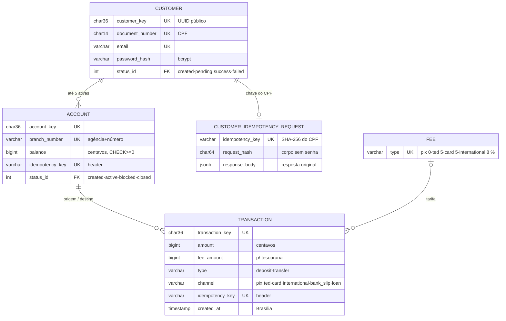
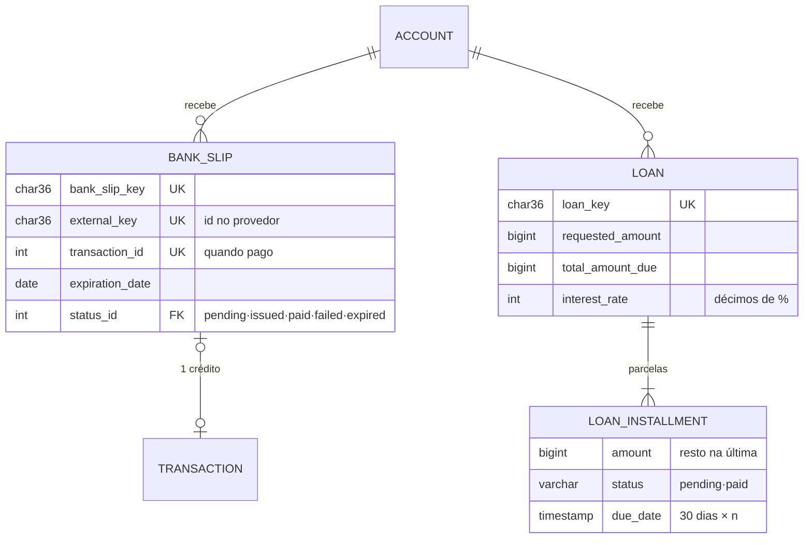
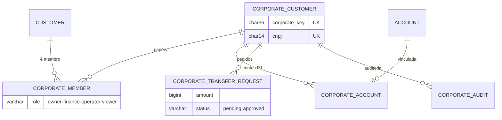
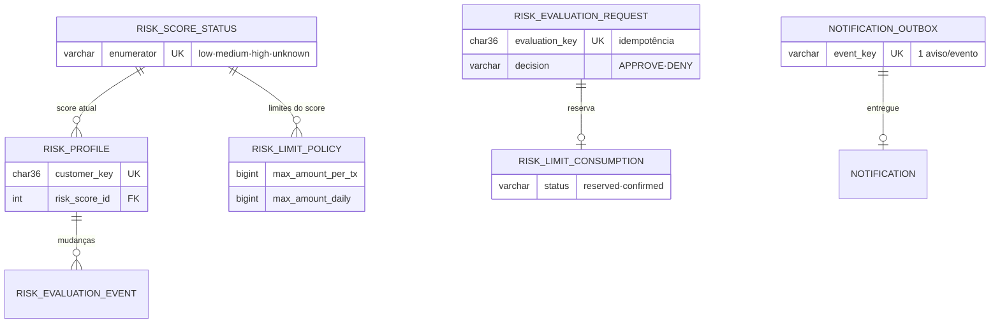

# RFC — Um core bancário em que cada centavo tem origem, destino e uma execução só

| | |
|---|---|
| **TIME** | Gabriel Farias De Marco · Lucas Rodrigues Hirashima · João Gabriel Iuzviak Mantagute |
| **DATA** | 04/10/2026 |
| **VERSÃO** | 2: inclui boleto, empréstimo, PJ, Motor de Risco, tesouraria e idempotência ponta a ponta (a v1, de 26/09, cobria só cadastro, conta, transferência e extrato) |

## Contextualização

### Entendendo o problema

O sistema é o núcleo de um banco digital. **Pessoas físicas** se cadastram, abrem até cinco contas, depositam, transferem por PIX, TED, cartão e internacional, consultam extrato, geram **boleto de depósito**, contratam **empréstimo** e pagam as parcelas. **Empresas** têm vários membros com papéis diferentes e só transferem com aprovação. Quem chama a API é o app do cliente, sempre autenticado, e sistemas parceiros (provedor de boletos e Motor de Risco), que falam de máquina para máquina.

A garantia é sobre o dinheiro, em quatro partes. **Nenhum centavo é criado** fora de depósito, boleto pago ou empréstimo concedido. **Nenhum some**: toda tarifa e toda parcela têm um destino. **Nada executa duas vezes**, nem quando o cliente repete o pedido depois de um timeout ou clica duas vezes, nem quando o provedor reenvia o aviso de pagamento. **O extrato explica o saldo.** Se uma dessas garantias falhar, aparecem saldo negativo por corrida entre transferências simultâneas, débito em dobro num retry, boleto creditado duas vezes e tarifa que sai da conta sem entrar em lugar nenhum: dinheiro que ninguém consegue explicar.

**Fora do escopo:** Pix copia-e-cola e QR Code; boleto de cobrança entre clientes e liquidação D+1; cobrança automática de parcela vencida (juros de mora, multa); cartão de crédito; câmbio real no canal internacional; provedor de boletos real, que é simulado por um mock com o mesmo contrato.

### Explicando a solução de forma macro

A solução é uma API REST em camadas (resource → controller → repository) sobre **um único PostgreSQL, que é a fonte da verdade do dinheiro**. Todo saldo muda por um `UPDATE` condicional dentro da mesma transação de banco que grava a operação e os eventos de status dela. O dinheiro só "existe" depois do commit.

Em volta desse núcleo ficam módulos que nunca seguram o livro-razão:
- o **Motor de Risco** (serviço, banco e Redis próprios) aprova ou nega cada transferência pelos limites do score do cliente antes do commit e, se não responde, nega (*fail-closed*);
- um **worker com LLM** reclassifica o score de tempos em tempos, fora do caminho da transferência;
- o **provedor de boletos** é chamado com timeout e confirma o pagamento por webhook;
- as **notificações** saem por *outbox* depois do commit, e uma falha delas não desfaz a operação.

A identidade do cliente vem só do JWT, e as chamadas de máquina usam `INTERNAL-TOKEN`. Cadastro, abertura de conta, depósito, transferência e contratação de empréstimo carregam uma **chave de idempotência**, e o banco garante, por `UNIQUE`, que ela tem um efeito só. Webhook de boleto, pagamento de parcela e aprovação PJ são idempotentes pelo status, com `FOR UPDATE`. Tarifas e parcelas entram numa **conta interna do banco (tesouraria)**, então todo débito tem um crédito.

<figure class="macro">
<svg viewBox="0 0 720 330" xmlns="http://www.w3.org/2000/svg" font-family="Inter" font-size="11">
  <defs>
    <marker id="a" viewBox="0 0 10 10" refX="9" refY="5" markerWidth="7" markerHeight="7" orient="auto-start-reverse"><path d="M0,0 L10,5 L0,10 z" fill="#4a5b77"/></marker>
  </defs>
  <!-- App -->
  <rect x="10" y="40" width="120" height="70" rx="8" fill="#f2fbff" stroke="#1c49a5"/>
  <text x="70" y="64" text-anchor="middle" font-weight="700" fill="#0a2051">App do cliente</text>
  <text x="70" y="81" text-anchor="middle" fill="#4a5b77" font-size="9">JWT · INTERNAL-TOKEN</text>
  <text x="70" y="94" text-anchor="middle" fill="#4a5b77" font-size="9">Idempotency-Key</text>
  <!-- Core -->
  <rect x="160" y="14" width="400" height="124" rx="10" fill="#f7fbff" stroke="#57d9ff" stroke-width="1.5"/>
  <text x="172" y="31" font-weight="700" fill="#1c49a5" font-size="10" letter-spacing="1">CORE BANCÁRIO · FASTAPI</text>
  <rect x="172" y="44" width="116" height="80" rx="7" fill="#fff" stroke="#1c49a5"/>
  <text x="230" y="68" text-anchor="middle" font-weight="700" fill="#0a2051">Middlewares</text>
  <text x="230" y="84" text-anchor="middle" fill="#4a5b77" font-size="9">request_id · log</text>
  <text x="230" y="97" text-anchor="middle" fill="#4a5b77" font-size="9">INTERNAL-TOKEN · JWT</text>
  <text x="230" y="110" text-anchor="middle" fill="#4a5b77" font-size="9">sessão de banco</text>
  <rect x="302" y="44" width="116" height="80" rx="7" fill="#fff" stroke="#1c49a5"/>
  <text x="360" y="68" text-anchor="middle" font-weight="700" fill="#0a2051">Controllers</text>
  <text x="360" y="84" text-anchor="middle" fill="#4a5b77" font-size="9">regras de negócio</text>
  <text x="360" y="97" text-anchor="middle" fill="#4a5b77" font-size="9">idempotência</text>
  <text x="360" y="110" text-anchor="middle" fill="#4a5b77" font-size="9">log de retorno</text>
  <rect x="432" y="44" width="116" height="80" rx="7" fill="#fff" stroke="#1c49a5"/>
  <text x="490" y="68" text-anchor="middle" font-weight="700" fill="#0a2051">Repositories</text>
  <text x="490" y="84" text-anchor="middle" fill="#4a5b77" font-size="9">únicas queries</text>
  <text x="490" y="97" text-anchor="middle" fill="#4a5b77" font-size="9">UPDATE condicional</text>
  <text x="490" y="110" text-anchor="middle" fill="#4a5b77" font-size="9">FOR UPDATE · lock</text>
  <line x1="288" y1="84" x2="300" y2="84" stroke="#4a5b77" marker-end="url(#a)"/>
  <line x1="418" y1="84" x2="430" y2="84" stroke="#4a5b77" marker-end="url(#a)"/>
  <!-- DB core -->
  <path d="M600,44 a50,9 0 0,0 100,0 a50,9 0 0,0 -100,0 v76 a50,9 0 0,0 100,0 v-76" fill="#f2fbff" stroke="#1c49a5"/>
  <text x="650" y="72" text-anchor="middle" font-weight="700" fill="#0a2051">PostgreSQL Core</text>
  <text x="650" y="88" text-anchor="middle" fill="#4a5b77" font-size="9">saldos · transações</text>
  <text x="650" y="101" text-anchor="middle" fill="#4a5b77" font-size="9">tesouraria · eventos</text>
  <text x="650" y="114" text-anchor="middle" fill="#4a5b77" font-size="9">outbox · chaves</text>
  <line x1="130" y1="75" x2="170" y2="75" stroke="#4a5b77" marker-end="url(#a)"/>
  <line x1="548" y1="84" x2="598" y2="84" stroke="#4a5b77" marker-end="url(#a)"/>
  <text x="573" y="78" text-anchor="middle" fill="#1c49a5" font-size="8.5" font-weight="700">commit</text>
  <!-- Risk -->
  <rect x="300" y="190" width="250" height="126" rx="10" fill="#f7fbff" stroke="#57d9ff" stroke-width="1.5"/>
  <text x="312" y="207" font-weight="700" fill="#1c49a5" font-size="10" letter-spacing="1">MOTOR DE RISCO</text>
  <rect x="312" y="218" width="110" height="56" rx="7" fill="#fff" stroke="#1c49a5"/>
  <text x="367" y="240" text-anchor="middle" font-weight="700" fill="#0a2051">POST /evaluate</text>
  <text x="367" y="256" text-anchor="middle" fill="#4a5b77" font-size="9">APPROVE · DENY</text>
  <text x="367" y="268" text-anchor="middle" fill="#4a5b77" font-size="9">limite por score</text>
  <path d="M436,226 a50,7 0 0,0 100,0 a50,7 0 0,0 -100,0 v40 a50,7 0 0,0 100,0 v-40" fill="#f2fbff" stroke="#1c49a5"/>
  <text x="486" y="248" text-anchor="middle" font-weight="700" fill="#0a2051" font-size="10">Postgres Risco</text>
  <text x="486" y="261" text-anchor="middle" fill="#4a5b77" font-size="9">+ Redis (cache)</text>
  <text x="425" y="300" text-anchor="middle" fill="#4a5b77" font-size="9">evaluation_key idempotente · reserva e confirma limite</text>
  <!-- worker -->
  <rect x="590" y="214" width="120" height="58" rx="8" fill="#fff" stroke="#1c49a5" stroke-dasharray="4 3"/>
  <text x="650" y="237" text-anchor="middle" font-weight="700" fill="#0a2051">Worker LLM</text>
  <text x="650" y="253" text-anchor="middle" fill="#4a5b77" font-size="9">a cada 6 h · Groq</text>
  <text x="650" y="265" text-anchor="middle" fill="#4a5b77" font-size="9">fora do caminho do $</text>
  <line x1="590" y1="246" x2="552" y2="246" stroke="#4a5b77" marker-end="url(#a)"/>
  <text x="571" y="240" text-anchor="middle" fill="#4a5b77" font-size="8">score</text>
  <path d="M650,214 C650,180 520,170 520,140" fill="none" stroke="#4a5b77" stroke-dasharray="4 3" marker-end="url(#a)"/>
  <text x="618" y="178" fill="#4a5b77" font-size="8">histórico via /internal</text>
  <!-- core -> risk -->
  <path d="M360,124 L360,188" fill="none" stroke="#4a5b77" marker-end="url(#a)"/>
  <text x="368" y="152" fill="#1c49a5" font-size="8.5" font-weight="700">antes do commit</text>
  <text x="368" y="164" fill="#4a5b77" font-size="8">timeout 3 s · fail-closed</text>
  <!-- boletos -->
  <rect x="10" y="214" width="150" height="62" rx="8" fill="#fff" stroke="#1c49a5" stroke-dasharray="4 3"/>
  <text x="85" y="237" text-anchor="middle" font-weight="700" fill="#0a2051">Provedor de boletos</text>
  <text x="85" y="253" text-anchor="middle" fill="#4a5b77" font-size="9">mock · timeout 5 s</text>
  <text x="85" y="265" text-anchor="middle" fill="#4a5b77" font-size="9">avisa o pagamento</text>
  <path d="M300,124 C300,170 200,180 160,226" fill="none" stroke="#4a5b77" marker-end="url(#a)"/>
  <text x="215" y="168" fill="#4a5b77" font-size="8">emite boleto</text>
  <path d="M60,214 C60,175 175,160 222,126" fill="none" stroke="#4a5b77" stroke-dasharray="4 3" marker-end="url(#a)"/>
  <text x="55" y="198" text-anchor="end" fill="#4a5b77" font-size="8">webhook: pago</text>
</svg>
</figure>

**Alternativas consideradas e descartadas:**
- **Saldo calculado em Python** (ler, somar, gravar) — descartada porque duas requisições simultâneas leem o mesmo saldo e as duas aprovam, deixando a conta negativa. Ganharia num processo único, sem concorrência.
- **Valores em reais com casas decimais (`float`)** — descartada porque ponto flutuante não representa centavos exatamente (`0.1 + 0.2` dá `0.30000000000000004`), e esses restos se acumulam em saldos e tarifas. Todo valor é um **inteiro em centavos** (`BIGINT`: R$ 10,50 é `1050`), e a tarifa usa divisão inteira, arredondada para baixo. Ganharia em cálculos aproximados, em que um erro na décima quinta casa não muda nada.
- **Chave de idempotência derivada dos dados da transferência** (valor + contas) — descartada porque duas transferências iguais podem ser legítimas: só quem chama sabe se é uma repetição. Ganharia onde existe um dado único por natureza. Por isso o cadastro de cliente usa o CPF.
- **Risco e LLM síncronos, dentro do core** — descartada porque a LLM leva de 0,5 a 15 s e pode cair, e essa latência e essa instabilidade entrariam no caminho do dinheiro. Ganharia se a classificação fosse uma regra local de milissegundos.
- **Liquidação do boleto assíncrona (fila + worker, D+1)**, proposta na RFC de expansão — descartada para o boleto de depósito: ninguém recebe milhares de pagamentos disputando a mesma conta, e `FOR UPDATE` no webhook já dá a idempotência. Ganharia com boleto de cobrança em escala.

## Implementação

### Rotas

<p class="note"><b>Valem para todas as rotas:</b> 403 sem <code>INTERNAL-TOKEN</code> (exceto <code>/</code> e <code>/health_check</code>). 401 sem JWT válido (exceto <code>POST /customers</code>, <code>/auth/login</code>, <code>/auth/refresh</code>, <code>/webhook/*</code> e <code>/internal/*</code>). 400 quando o corpo ou a query não seguem o schema. No Core, todo erro sai como <code>{title, description, translation, code}</code>; o Motor de Risco responde <code>{error_code, message}</code>. Valores em centavos. <b>GET é sempre idempotente</b> (só leitura).</p>

| MÉTODO | CAMINHO | O QUE FAZ | ENTRADA (CAMPOS QUE IMPORTAM) | SAÍDAS (STATUS E QUANDO) |
|---|---|---|---|---|
| POST | `/customers` | Cadastra pessoa física. **Idempotente pelo CPF**: o servidor deriva a chave (SHA-256 do CPF) e repetir o mesmo cadastro devolve o cliente da primeira vez | `name`, `document_number`, `email`, `birthdate`, `password` | 201 criado (ou o original, se for repetição); 409 `QIT001004` CPF já cadastrado, inclusive mesmo CPF com outros dados ou cliente encerrado, `QIT001005` e-mail em uso; 422 `QIT001003` CPF inválido, `QIT001007` menor de 18 anos, `QIT001009` data inexistente |
| GET | `/customers` · `/customers/{key}` | Lista e consulta, só o próprio cliente | `limit`, `page` | 200; 403 outro cliente; 404 |
| PATCH | `/customers/{key}` | Altera nome e e-mail | `name`, `email` | 200; 403; 404; 409 `QIT001005` |
| DELETE | `/customers/{key}` | Encerramento lógico: fecha as contas, anonimiza nome e e-mail, invalida a senha e mantém o CPF. Encerrar de novo não muda nada | — | 204; 403; 404; 409 `QIT001023` há saldo |
| POST | `/auth/login` | Emite access (15 min) e refresh (7 dias). A tesouraria nunca loga, nem com a senha certa | `document_number`, `password` | 200; 401 `QIT002001`, com a mesma resposta e o mesmo tempo para CPF inexistente, senha errada e tesouraria |
| POST | `/auth/refresh` · PUT `/auth/password` | Renova o access token · troca a senha | `refresh_token` · `current_password`, `new_password` | 200; 401 `QIT002002` token inválido · `QIT002001` senha atual errada |
| POST | `/customers/{key}/accounts` | Abre conta (agência 0001, número sorteado). **Idempotente pelo header `Idempotency-Key`**: a mesma chave devolve a mesma conta | `type` (checking/savings), header `Idempotency-Key` (UUID) | 201 (ou a conta original); 400 `QIT001028` sem chave ou chave fora do formato UUID; 403 outro cliente ou cliente encerrado; 404; 409 `QIT001027` chave reusada com outro tipo ou por outro cliente; 422 `QIT001013` já tem 5 contas ativas ou bloqueadas (as contas PJ abertas pela pessoa entram na conta) |
| GET | `/accounts` · `/accounts/{key}` · `/{key}/balance` | Contas do cliente · detalhe · saldo | filtros, `limit`, `page` | 200; 403 conta alheia; 404 |
| PUT | `/accounts/{key}` | Bloqueia, desbloqueia ou encerra a conta | `status` | 200; 403; 404; 409 `QIT001016` transição inválida, `QIT001017` encerrar com saldo |
| GET | `/accounts/{key}/statement` | Extrato paginado, mais recente primeiro (origem **ou** destino) | `date_from`, `date_to`, `limit` ≤ 100, `page` | 200; 400 `date_from` > `date_to`; 403; 404 |
| POST | `/transactions` | Depósito na própria conta ou transferência com tarifa. **Idempotente pelo header `Idempotency-Key`**: repetir devolve a mesma `transaction_key` sem novo débito | `type`, `channel`, `amount` (1 a R$ 1 bi), `origin_account_key`, `destination_account_key`, header `Idempotency-Key` | 201 (ou a original); 400 `QIT001028` sem chave, origem = destino; 403 conta alheia, bloqueada ou a tesouraria, `QIT009001` Risco negou ou não respondeu; 404 conta; 409 `QIT001027` chave reusada com outro pedido; 422 `QIT001014` saldo insuficiente (valor + tarifa), `QIT001021` sem origem |
| GET | `/transactions/{key}` · `/transactions` | Consulta (só quem é origem ou destino) · lista filtrada por conta própria | `origin_account_key` ou `destination_account_key` | 200; 400 sem filtro de conta; 403; 404 |
| POST | `/accounts/{key}/bank_slips` | Emite boleto de depósito: grava `pending`, chama o provedor e marca `issued`. Não idempotente: repetir gera outro boleto, que só credita se for pago | `amount` (até R$ 100 mil), `expiration_date` (padrão hoje + 3; até hoje + 60) | 201; 403 conta alheia ou inativa; 404; 422 `QIT001025` vencimento inválido; 503 `QIT003001` provedor fora do ar ou lento (o boleto vira `failed`) |
| POST | `/webhook/bank_slips/{key}/paid` | O provedor avisa o pagamento e a conta é creditada. **Idempotente por `FOR UPDATE` + status**: só um `issued` paga | sem JWT; INTERNAL-TOKEN **e** header `BANKSLIP-WEBHOOK-TOKEN` (segredo só do provedor; o INTERNAL-TOKEN todo app cliente tem) | 200; 403 `QIT002003` sem o segredo do provedor; 404 `QIT001024`; 409 `QIT001026` já pago, falho ou conta inativa (aviso repetido não credita de novo) |
| GET | `/bank_slips/{key}` · `/accounts/{key}/bank_slips` | Consulta · lista paginada | `limit`, `page` | 200; 403; 404 |
| POST | `/loans/simulate` · `/loans` | Simula sem gravar · contrata e credita o valor (extrato: `deposit`, canal `loan`). **Contratação idempotente pelo header `Idempotency-Key`**: repetir devolve o mesmo empréstimo, sem crédito novo nem nova consulta ao Risco. Juros únicos sobre o valor pedido: 1,5% no score low, 3% no medium ou unknown (Risco fora do ar conta como unknown) | `account_key`, `requested_amount` (até R$ 50 mil), `installments_count` (1 a 48); header `Idempotency-Key` em `/loans` | 200 · 201 (ou o original); 400 `QIT001028` sem chave; 403 conta alheia ou inativa; 404; 409 `QIT001027` chave reusada com outro pedido; 422 `QIT005001` score high |
| POST | `/loans/{key}/installments/{id}/pay` | Paga a parcela e credita a tesouraria. **Idempotente por `FOR UPDATE` + status**: a 2ª tentativa encontra a parcela paga | — | 204; 403; 404 `QIT005003` parcela inexistente ou já paga; 422 `QIT005002` saldo insuficiente (a parcela continua `pending`) |
| POST | `/corporates` · `/{key}/members` · `/{key}/accounts` | Cadastra empresa (quem cria vira `owner`) · adiciona membro (só `owner`; remover: `DELETE …/members/{customer_key}`) · abre conta PJ (`owner`/`finance`, entra no limite de 5 contas de quem abre) · `GET /corporates/{key}` consulta | `cnpj`, `company_name` · `customer_key`, `role` | 201; 403 papel sem permissão; 404 `QIT004003` empresa inexistente; 409 `QIT004002` CNPJ duplicado, `QIT004004` já é membro; 422 `QIT004001` CNPJ inválido |
| POST | `/corporates/{key}/transfers` | Pede transferência PJ (`owner`/`finance`/`operator`). Não move dinheiro. Não idempotente: repetir cria outro pedido, que também precisa de aprovação | `origin_account_key` (conta da empresa), `destination_account_key`, `amount` | 201 `pending`; 403 papel ou `QIT004006` conta não é da empresa; 404 |
| POST | `/corporates/{key}/transfers/{id}/approve` | Aprova e executa (`owner`/`finance`). **Idempotente por `FOR UPDATE` + status**: aprovações simultâneas executam uma vez | — | 200 `approved`; 403 papel ou pedido já aprovado, `QIT009001` Risco; 404 `QIT004005`; 422 saldo |
| GET · PATCH | `/notifications` · `/notifications/{key}/read` | Lista as notificações do cliente · marca como lida | — | 200; 403 de outro cliente; 404 |
| GET | `/internal/customers/{key}/transactions` | Histórico de 30 dias para o worker LLM | header `RISK-WORKER-TOKEN`, `days` ≤ 90, `limit` ≤ 100 | 200; 400; 403 sem o segredo do Risco; 404 |
| POST | `/internal/notifications/reprocess` · `/internal/customers/idempotency/cleanup` | Reprocessa avisos `pending` do outbox · apaga registros de idempotência do cadastro mais antigos que a retenção (depois disso, repetir o cadastro dá 409 `QIT001004`, porque o CPF continua único) | header `RISK-WORKER-TOKEN`, `limit` · `retention_days` (padrão 7) | 200 `{…_count}`; 403 sem o segredo |
| POST | Risco: `/evaluate` · `/evaluate/{k}/confirm` | Decide APPROVE ou DENY pelo limite por transação e diário do score. **Idempotente por `evaluation_key`**. Reserva o limite e confirma depois do commit no Core | `evaluation_key`, `customer_key`, `amount`, `transaction_type` | 200 `{action}`; 404 `RISK005` avaliação inexistente; 409 `RISK004` chave reusada com outro pedido |
| POST | Risco: `/reconciliation/limit-reservations` | Libera reservas de limite que nunca foram confirmadas (o commit no Core falhou depois do APPROVE) | `max_age_minutes` (padrão 15) | 200 |
| GET · PATCH | Risco: `/risk_profile` · `/risk_profile/{key}` | Lista os perfis (usada pelo worker) · consulta o score · o worker grava o novo score (gera evento e invalida o cache) | `score`, `reason` | 200; 404 `RISK002`; 422 `RISK003` score inválido |

### Banco de Dados (Somente diagrama)

<div class="er-grid">
<div class="er-cell">
<p class="er-label">1 · Cliente, conta e transação</p>



</div>
<div class="er-cell">
<p class="er-label">2 · Boleto e empréstimo</p>



</div>
<div class="er-cell">
<p class="er-label">3 · Pessoa jurídica</p>



</div>
<div class="er-cell">
<p class="er-label">4 · Motor de Risco (banco próprio) e outbox</p>



</div>
</div>

<p class="caption">Diagramas 1 a 3: Core. Diagrama 4: banco próprio do Motor de Risco e outbox de notificações (que mora no Core). Todo id interno é <code>SERIAL</code> e o que sai na resposta é a <code>*_key</code> (UUID). As exceções são o id da parcela e o <code>request_id</code> do pedido PJ, que aparecem nas rotas. Cliente, conta, transação e boleto têm tabela <code>*_status_event</code> (de → para, motivo, quando); a PJ usa <code>corporate_audit</code>, e empréstimo e parcela guardam só o status atual. A tesouraria é uma linha fixa de <code>ACCOUNT</code> (<code>00000000-0000-4000-8000-000000000002</code>), que nenhum cliente acessa. O dono dela é um <code>CUSTOMER</code> fixo (o banco), com senha desconhecida e login recusado por regra. A tarifa cobrada é um <b>campo da transação</b> (<code>fee_amount</code>, em centavos), e não uma entidade a mais: ela nasce, é creditada na tesouraria e é desfeita junto com a transferência, no mesmo commit. A tabela <code>fee</code> guarda só o percentual de cada canal.</p>

### Fluxos

<div class="flow-title">Transferência (POST /transactions) — caminho feliz</div>

1. O resource valida o corpo pelo schema e lê o header `Idempotency-Key`. Sem chave, ou fora do formato UUID: **400 `QIT001028`** antes de qualquer acesso ao banco.
2. O controller identifica o cliente pelo JWT e pega um **advisory lock do Postgres para a chave** (`pg_advisory_xact_lock`). Um segundo pedido com a mesma chave espera aqui até o primeiro terminar.
3. `existing = transaction_repository.get_by_idempotency_key(chave)` volta vazio, então é um pedido novo.
4. Confere as contas: ambas ativas, a origem é do cliente, origem ≠ destino e o destino não é a tesouraria. Calcula a tarifa pela tabela `fee` (divisão inteira, arredondada para baixo).
5. Debita valor + tarifa com `UPDATE account SET balance = balance − x WHERE id = ? AND balance >= x` e credita o destino. As duas contas são atualizadas **na ordem crescente de `id`**, para que A→B e B→A simultâneas não entrem em deadlock.
6. Chama o Motor de Risco (`POST /evaluate`, timeout de 3 s, `evaluation_key` nova). O Risco reserva o limite diário e responde APPROVE.
7. Credita a tarifa na **tesouraria**, sempre a última conta travada. Grava a transação (com a chave), o evento `pending → confirmed` e o aviso no **outbox**.
8. **Commit.** Saldos, transação, eventos e outbox entram juntos. O lock da chave é liberado.
9. Depois do commit, confirma a avaliação no Risco (`/evaluate/{k}/confirm`) e entrega a notificação. Se qualquer um dos dois falhar, a transferência não é desfeita. Responde **201** com a `transaction_key`.

<div class="flow-title">Transferência — falha: timeout e o cliente tenta de novo</div>

1. O app não recebeu a resposta do passo 9 e reenvia o **mesmo corpo com a mesma chave**. Pode ser um clique duplo: cinco pedidos chegando juntos.
2. O pedido repetido espera o advisory lock da chave até o primeiro commitar.
3. Agora `existing` volta preenchido. O controller confere se o pedido é o mesmo: mesmo dono, tipo, canal, valor, origem e destino.
4. É o mesmo pedido: devolve **201 com a mesma `transaction_key`**, sem tocar em saldo, Risco ou tesouraria. O log registra "Transação repetida: devolvendo a original".
5. A mesma chave com outro valor, ou vinda de outro cliente: **409 `QIT001027`**. Nada se move e nada da transação original vaza.
6. Se, mesmo assim, duas gravações com a mesma chave chegassem ao banco, o `UNIQUE(idempotency_key)` recusaria a segunda e o rollback desfaria o débito dela.

<div class="flow-title">Transferência — falha: saldo insuficiente ou Risco nega</div>

1. Saldo insuficiente: o `UPDATE` condicional do passo 5 não altera nenhuma linha. A API responde **422 `QIT001014`** e o rollback desfaz o crédito no destino, se ele já tiver sido feito (acontece quando o id do destino é menor que o da origem).
2. Risco nega, ou não responde em 3 s (*fail-closed*): **403 `QIT009001`**. O rollback desfaz débito e crédito, nada é commitado e a tarifa não chega à tesouraria.

<div class="flow-title">Abertura de conta — caminho feliz · falha: retry e 6ª conta</div>

1. `Idempotency-Key` obrigatória. Sorteia agência e número, pega o advisory lock da chave e faz `existing = account_repository.get_by_idempotency_key(chave)`.
2. Pedido novo: conta as contas ativas e bloqueadas do cliente. Com menos de 5, grava a conta com a chave e o evento `active` e responde **201**.
3. Retry com a mesma chave: devolve **a mesma conta**, mesmo que ela seja a 5ª. Não conta de novo no limite, e o número sorteado neste pedido é descartado.
4. Pedido novo com 5 contas ativas: **422 `QIT001013`**. A mesma chave com outro tipo de conta: **409 `QIT001027`**.

A chave **não pode** vir de agência + número: o número é sorteado a cada pedido, então um retry geraria outra chave e abriria uma segunda conta.

<div class="flow-title">Cadastro de cliente — idempotente pelo CPF</div>

1. O servidor calcula `SHA-256("customer:" + dígitos do CPF)`. O CPF nunca é usado em texto como chave.
2. Advisory lock dessa chave e `existing = get_idempotency_request(chave)`.
3. Se existe e é o mesmo cadastro (mesmo hash do corpo sem a senha, e a senha confere no bcrypt): devolve **201 com o cliente original**.
4. Mesmo CPF com outros dados, ou de um cliente já encerrado: **409 `QIT001004`**. Cinco cadastros simultâneos iguais criam **um** cliente.

<div class="flow-title">Boleto — emissão e pagamento · falha: provedor fora e aviso repetido</div>

1. Grava o boleto `pending` e **faz o commit antes de chamar o provedor**: se a API cair no meio, fica o registro da tentativa.
2. Chama o provedor com timeout de 5 s. Se ele responde 201, grava `external_key` e código de barras, marca `issued` e responde **201**.
3. Falha: timeout, erro de conexão ou qualquer resposta diferente de 201. O boleto vira `failed` e a API responde **503 `QIT003001`**.
4. Pagamento: o provedor chama `POST /webhook/bank_slips/{key}/paid` com o segredo dele no `BANKSLIP-WEBHOOK-TOKEN` (sem o segredo: **403**, e nenhum cliente consegue se autopagar). `SELECT … FOR UPDATE` no boleto. Se está `issued` e a conta está ativa, credita, grava a transação (`deposit`, canal `bank_slip`), marca `paid` e faz o commit.
5. O provedor reenvia o aviso, ou manda cinco ao mesmo tempo: o segundo espera a trava, encontra `paid` e recebe **409 `QIT001026`**. O crédito aconteceu uma vez.

<div class="flow-title">Empréstimo — contratação e parcela · Transferência PJ — aprovação</div>

1. Contratação: mesmo modelo da transferência. `Idempotency-Key` obrigatória, advisory lock da chave e `existing` buscado pela chave **antes** de consultar o Risco. Retry devolve o mesmo `loan_key` (com o status atual das parcelas), sem crédito novo; mesma chave com outra conta, valor ou número de parcelas: **409 `QIT001027`**.
2. Pagamento de parcela: `SELECT … FOR UPDATE` na parcela `pending`, débito condicional, crédito na **tesouraria** e lançamento no extrato (`transfer`, canal `loan`). Sem saldo: **422 `QIT005002`** e a parcela continua `pending`. Repetição: **404 `QIT005003`**, porque a parcela já está paga.
3. Aprovação PJ: `SELECT … FOR UPDATE` no pedido. O status `approved` é gravado **antes** de executar a transferência, porque a transferência faz commit internamente e soltaria a trava. Owner e finance aprovando juntos: uma transferência, e a segunda aprovação recebe **403**.

<div class="challenge">
<h4>Principal desafio</h4>
<ul>
<li><b>Qual é:</b> executar cada movimento de dinheiro <b>exatamente uma vez</b>, com o saldo sempre certo, quando os pedidos chegam ao mesmo tempo e se repetem: clique duplo, retry depois de timeout, aviso de boleto reenviado, dois aprovadores na mesma hora.</li>
<li><b>Por que é difícil:</b> o caminho óbvio, "ler o saldo, conferir, gravar" e "procurar a chave, não achar, executar", tem uma janela entre a leitura e a escrita. Duas requisições passam juntas por ela e as duas executam. E o timeout cria uma dúvida que o cliente não consegue resolver sozinho: se tentar de novo, pode debitar duas vezes; se não tentar, pode ter ficado sem a transferência.</li>
<li><b>Como o desenho resolve:</b> a decisão sai do Python e vai para o banco. (1) O saldo muda por <code>UPDATE … WHERE balance >= x</code>, com as contas travadas sempre na mesma ordem e a tesouraria por último. (2) A chave de idempotência vem de quem chama, no header. No cadastro, o servidor deriva a chave do CPF. Em ambos os casos, ela é serializada por um <i>advisory lock</i>. A repetição devolve o resultado original e o <code>UNIQUE</code> é a última barreira. (3) Boleto, parcela e pedido PJ usam <code>SELECT … FOR UPDATE</code> e mudam o status antes de qualquer commit interno. (4) Tudo o que é externo (Risco, provedor, notificação) tem timeout e fica fora do commit, ou nega por padrão: na transferência, Risco indisponível vira recusa. Uma falha lá fora nunca deixa o dinheiro pela metade.</li>
</ul>
</div>

<div class="appendix" markdown="1">

## Anexo — Como rodar o projeto

<p class="note">Este anexo fica fora das seções do modelo. Ele serve para a banca subir o projeto numa máquina limpa e rodar a suíte de testes.</p>

**Pré-requisitos:** Git, Docker com Docker Compose e Python 3.11 (só para rodar os testes fora do container).

**1. Clonar e configurar**

```bash
git clone https://github.com/gfdmarco/BootcampQITechG33.git
cd BootcampQITechG33
cp .env.example .env          # os valores padrão funcionam com o compose
# opcional: GROQ_API_KEY=<sua chave>, para o worker LLM classificar de verdade
```

**2. Subir os 7 serviços**

```bash
docker compose up -d --build
docker compose ps           # espere ficarem (healthy); o risk_worker não tem healthcheck e aparece só como Up
```

| Serviço | Porta local | Papel |
|---|---|---|
| `api` | 3000 | Core bancário (FastAPI) |
| `db` | 5432 (`DB_PORT`) | PostgreSQL do Core |
| `bankslip-mock` | 8080 | Provedor de boletos simulado (valor 666 → erro 500, 777 → timeout) |
| `risk_engine` · `db_risk` | 8001 · 5433 | Motor de Risco e o banco dele |
| `risk_worker` | — | Worker LLM: reclassifica o score a cada 6 h |
| `redis` | 6379 | Cache do score e dos limites do Risco (o consumo diário é lido do Postgres de risco) |

Se uma porta estiver ocupada, troque no `.env` (`API_PORT`, `DB_PORT`…). Se mudar a `DB_PORT`, mude também a porta na `DATABASE_URL`.

**3. Rodar os testes** (a maioria é caixa-preta, via HTTP, contra a API que o compose subiu; alguns leem os bancos direto, pelas portas do `.env`, e `tests/unit` importa o código)

```bash
python3 -m venv venv && source venv/bin/activate
pip install -r requirements-dev.txt
pytest -q tests
```

Se outro ambiente injetar plugins no pytest (ROS, por exemplo), rode `unset PYTHONPATH` antes ou use `PYTEST_DISABLE_PLUGIN_AUTOLOAD=1 pytest -q tests`.

**4. Chamar a API na mão**

```bash
# cadastro (rota pública; a idempotência vem do CPF)
curl -X POST localhost:3000/customers -H "INTERNAL-TOKEN: default_token" \
  -H "Content-Type: application/json" \
  -d '{"name":"Ana","email":"ana@ex.com","document_number":"529.982.247-25","birthdate":"1990-01-01","password":"Senha1234"}'

# login → access_token
curl -X POST localhost:3000/auth/login -H "INTERNAL-TOKEN: default_token" \
  -H "Content-Type: application/json" -d '{"document_number":"529.982.247-25","password":"Senha1234"}'

# abrir conta: Idempotency-Key obrigatória (um UUID novo por operação)
curl -X POST localhost:3000/customers/<customer_key>/accounts -H "INTERNAL-TOKEN: default_token" \
  -H "Authorization: Bearer <access_token>" -H "Idempotency-Key: $(uuidgen)" \
  -H "Content-Type: application/json" -d '{"type":"checking"}'

# depósito e transferência: num retry, repita a MESMA chave da tentativa original
curl -X POST localhost:3000/transactions -H "INTERNAL-TOKEN: default_token" \
  -H "Authorization: Bearer <access_token>" -H "Idempotency-Key: $(uuidgen)" \
  -H "Content-Type: application/json" \
  -d '{"type":"transfer","channel":"pix","amount":1000,"origin_account_key":"<sua conta>","destination_account_key":"<outra conta>"}'
```

**5. Logs e banco**

```bash
docker compose logs -f api          # ENTROU / RETORNO / SAIU, com o mesmo request_id
docker compose logs -f risk_worker  # classificação do score pela LLM
docker compose down -v && docker compose up -d --build   # recria os bancos (necessário quando o .sql muda)
```

O log de retorno nunca leva dado sensível: CPF e CNPJ saem com asteriscos (`123.***.***-**`), e-mail sai como `a***@ex.com`, senha aparece só como resultado (`password=created`, `password=verified`), tokens aparecem como `<emitido>` e o saldo como `<oculto>`.

</div>
